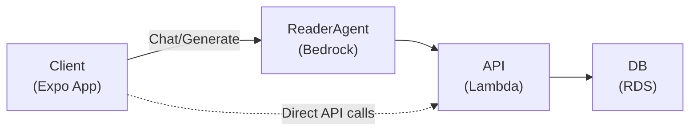

# Comprehend App - Development Plan

This document outlines the phased development plan for the Comprehend reading comprehension application. Each phase contains minimal units of work that can be developed independently while maintaining logical dependencies.

## Table of Contents

- [Architecture Overview](#architecture-overview)
- [Development Principles](#development-principles)
- [Phase 0: Foundation & Infrastructure](#phase-0-foundation--infrastructure)
- [Phase 1: Authentication](#phase-1-authentication)
- [Phase 2: Core Data Models & Database](#phase-2-core-data-models--database)
- [Phase 3: Exercise Management API](#phase-3-exercise-management-api)
- [Phase 4: Reader Screen & Content Display](#phase-4-reader-screen--content-display)
- [Phase 5: ReaderAgent Integration](#phase-5-readeragent-integration)
- [Phase 6: Vocab & Chat Features](#phase-6-vocab--chat-features)
- [Phase 7: History & Search](#phase-7-history--search)
- [Phase 8: Export Features](#phase-8-export-features)
- [Phase 9: Polish & Optimization](#phase-9-polish--optimization)
- [Appendix: API Specification](#appendix-api-specification)
- [Appendix: Database Schema](#appendix-database-schema)

## Architecture Overview



### Key Components

| Component | Technology | Location |
|-----------|------------|----------|
| Client | React Native (Expo) | `comprehend/` |
| API | AWS Lambda + API Gateway | `cdk/lib/lambda/api/` |
| ReaderAgent | AWS Bedrock (Claude) | `cdk/lib/lambda/agent/` |
| Database | Amazon RDS (PostgreSQL) | `cdk/lib/constructs/database/` |
| Auth | Amazon Cognito | `cdk/lib/constructs/auth/` |
| Infrastructure | AWS CDK | `cdk/lib/` |

## Development Principles

### Testing Strategy

- **Tests are written in parallel with features**, not as a separate phase
- Each unit of work MUST include its tests before merge
- Follow testing patterns in `cdk/docs/testing/` and `comprehend/docs/testing/`

### Backend Patterns (CDK)

- Follow [Agent Pattern](./cdk/docs/agent-pattern.md) for Lambda functions
- Follow [Types and Configuration](./cdk/docs/types-and-configuration.md) for type definitions
- Use `clientConfig` pattern for all AWS clients to support LocalStack testing

### Frontend Patterns (Comprehend)

- Follow [Context Pattern](./comprehend/docs/context-pattern.md) for state management
- Follow [Component Architecture](./comprehend/docs/component-architecture.md) for components
- Follow [Accessibility Guidelines](./comprehend/docs/accessibility.md) for all UI work
- Follow [API Integration](./comprehend/docs/api-integration.md) for backend calls

### Definition of Done

A unit of work is complete when:

1. ✅ Implementation is complete
2. ✅ Unit tests pass (>80% coverage)
3. ✅ Integration tests pass (where applicable)
4. ✅ Linting passes
5. ✅ TypeScript compiles without errors
6. ✅ Documentation is updated (if needed)
7. ✅ Accessibility requirements met (frontend)

## Phase 0: Foundation & Infrastructure

**Goal**: Set up the foundational infrastructure and project structure.

### 0.1 CDK Stack Structure

**Location**: `cdk/lib/`

| Unit | Description | Dependencies | Tests |
|------|-------------|--------------|-------|
| 0.1.1 | Create base stack with environment configuration | None | Stack synthesis test |
| 0.1.2 | Set up VPC construct with public/private subnets | 0.1.1 | VPC configuration tests |
| 0.1.3 | Set up shared types and interfaces | 0.1.1 | Type compilation |

**Files to create**:

```plaintext
cdk/lib/
├── stacks/
│   └── comprehend-stack.ts
├── constructs/
│   └── networking/
│       └── vpc.ts
└── types/
    └── index.ts
```

### 0.2 Database Infrastructure

**Location**: `cdk/lib/constructs/database/`

| Unit | Description | Dependencies | Tests |
|------|-------------|--------------|-------|
| 0.2.1 | Create RDS Aurora PostgreSQL cluster construct | 0.1.2 | Cluster configuration test |
| 0.2.2 | Create database credentials in Secrets Manager | 0.2.1 | Secret creation test |
| 0.2.3 | Create database bootstrap Lambda (schema creation) | 0.2.1, 0.2.2 | Unit + integration tests |

**Schema to implement** (see [Appendix: Database Schema](#appendix-database-schema))

### 0.3 Expo App Structure

**Location**: `comprehend/`

| Unit | Description | Dependencies | Tests |
|------|-------------|--------------|-------|
| 0.3.1 | Set up theme system with accessible colors | None | Theme unit tests |
| 0.3.2 | Create base component library (Button, Input, Text) | 0.3.1 | Component unit tests |
| 0.3.3 | Set up navigation structure with file-based routing | 0.3.2 | Navigation tests |
| 0.3.4 | Create environment configuration system | None | Config tests |

**Files to create**:

```plaintext
comprehend/
├── constants/
│   ├── theme.ts
│   └── config.ts
├── components/
│   └── ui/
│       ├── Button.tsx
│       ├── Input.tsx
│       ├── Text.tsx
│       └── index.ts
├── types/
│   └── index.ts
└── app/
    ├── _layout.tsx
    └── (auth)/
        └── _layout.tsx
```

## Phase 1: Authentication

**Goal**: Implement user registration, login, and session management.

### 1.1 Cognito Infrastructure

**Location**: `cdk/lib/constructs/auth/`

| Unit | Description | Dependencies | Tests |
|------|-------------|--------------|-------|
| 1.1.1 | Create Cognito User Pool construct | 0.1.1 | User Pool configuration test |
| 1.1.2 | Create User Pool Client with appropriate scopes | 1.1.1 | Client configuration test |
| 1.1.3 | Export User Pool outputs for client consumption | 1.1.2 | Output validation test |

### 1.2 Users API

**Location**: `cdk/lib/lambda/api/users/`

| Unit | Description | Dependencies | Tests |
|------|-------------|--------------|-------|
| 1.2.1 | Create POST /users handler (create user in DB) | 0.2.3, 1.1.1 | Unit + integration tests |
| 1.2.2 | Create DELETE /users/{id} handler | 1.2.1 | Unit + integration tests |
| 1.2.3 | Create user provider for database operations | 0.2.3 | Provider unit tests |

**Files to create**:

```plaintext
cdk/lib/lambda/api/users/
├── handler.ts
├── user-agent.ts
├── user-provider.ts
├── types.ts
├── validator.ts
└── __tests__/
    ├── handler.test.ts
    ├── user-agent.test.ts
    └── user-provider.test.ts
```

### 1.3 Client Authentication

**Location**: `comprehend/`

| Unit | Description | Dependencies | Tests |
|------|-------------|--------------|-------|
| 1.3.1 | Create auth service (signup, signin, signout) | 0.3.4 | Service unit tests |
| 1.3.2 | Create secure token storage with SecureStore | 1.3.1 | Storage unit tests |
| 1.3.3 | Create session management service | 1.3.1, 1.3.2 | Session unit tests |
| 1.3.4 | Create AuthContext with state and actions | 1.3.1, 1.3.2, 1.3.3 | Context unit tests |
| 1.3.5 | Create Login screen | 1.3.4, 0.3.2 | Screen unit + a11y tests |
| 1.3.6 | Create Registration screen | 1.3.4, 0.3.2 | Screen unit + a11y tests |
| 1.3.7 | Create protected route component | 1.3.4 | Route protection tests |

**Files to create**:

```plaintext
comprehend/
├── services/
│   └── auth/
│       ├── signup.ts
│       ├── signin.ts
│       ├── session.ts
│       ├── storage.ts
│       └── __tests__/
├── contexts/
│   └── AuthContext/
│       ├── Context.tsx
│       ├── Provider.tsx
│       ├── use-auth-context.ts
│       └── __tests__/
├── components/
│   └── ProtectedRoute.tsx
└── app/
    └── (auth)/
        ├── login.tsx
        └── register.tsx
```

## Phase 2: Core Data Models & Database

**Goal**: Implement the core exercise data model and database operations.

### 2.1 Exercise Database Operations

**Location**: `cdk/lib/lambda/api/exercises/`

| Unit | Description | Dependencies | Tests |
|------|-------------|--------------|-------|
| 2.1.1 | Create exercise types and interfaces | 0.2.3 | Type compilation |
| 2.1.2 | Create exercise provider (CRUD operations) | 2.1.1, 0.2.3 | Provider unit tests |
| 2.1.3 | Create exercise validator | 2.1.1 | Validator unit tests |

### 2.2 Token Database Operations

**Location**: `cdk/lib/lambda/api/exercises/`

| Unit | Description | Dependencies | Tests |
|------|-------------|--------------|-------|
| 2.2.1 | Create token types and interfaces | 2.1.1 | Type compilation |
| 2.2.2 | Create token provider (CRUD operations) | 2.2.1, 0.2.3 | Provider unit tests |

### 2.3 Vocab Database Operations

**Location**: `cdk/lib/lambda/api/exercises/`

| Unit | Description | Dependencies | Tests |
|------|-------------|--------------|-------|
| 2.3.1 | Create vocab types and interfaces | 2.1.1, 2.2.1 | Type compilation |
| 2.3.2 | Create vocab provider (CRUD with join table) | 2.3.1, 0.2.3 | Provider unit tests |
| 2.3.3 | Create vocab-token relationship handler | 2.2.2, 2.3.2 | Relationship tests |

### 2.4 Chat Message Database Operations

**Location**: `cdk/lib/lambda/api/exercises/`

| Unit | Description | Dependencies | Tests |
|------|-------------|--------------|-------|
| 2.4.1 | Create chat message types and interfaces | 2.1.1 | Type compilation |
| 2.4.2 | Create chat message provider | 2.4.1, 0.2.3 | Provider unit tests |

## Phase 3: Exercise Management API

**Goal**: Implement the REST API for exercise CRUD operations.

### 3.1 API Gateway Setup

**Location**: `cdk/lib/constructs/api/`

| Unit | Description | Dependencies | Tests |
|------|-------------|--------------|-------|
| 3.1.1 | Create API Gateway REST API construct | 0.1.1, 1.1.1 | API configuration test |
| 3.1.2 | Configure Cognito authorizer | 3.1.1, 1.1.2 | Authorizer test |
| 3.1.3 | Create API response utilities | 3.1.1 | Utility tests |

### 3.2 Exercise Endpoints

**Location**: `cdk/lib/lambda/api/exercises/`

| Unit | Description | Dependencies | Tests |
|------|-------------|--------------|-------|
| 3.2.1 | Create POST /exercises handler (create) | 3.1.2, 2.1.2 | Unit + integration tests |
| 3.2.2 | Create GET /exercises handler (list with query) | 3.1.2, 2.1.2 | Unit + integration tests |
| 3.2.3 | Create GET /exercises/{id} handler (with includes) | 3.1.2, 2.1.2, 2.2.2, 2.3.2, 2.4.2 | Unit + integration tests |
| 3.2.4 | Create PATCH /exercises/{id} handler | 3.1.2, 2.1.2 | Unit + integration tests |
| 3.2.5 | Create DELETE /exercises/{id} handler | 3.1.2, 2.1.2 | Unit + integration tests |

### 3.3 Vocab Endpoints

**Location**: `cdk/lib/lambda/api/vocab/`

| Unit | Description | Dependencies | Tests |
|------|-------------|--------------|-------|
| 3.3.1 | Create POST /exercises/{id}/vocab handler | 3.1.2, 2.3.2 | Unit + integration tests |
| 3.3.2 | Create GET /exercises/{id}/vocab handler | 3.1.2, 2.3.2 | Unit + integration tests |
| 3.3.3 | Create PATCH /exercises/{id}/vocab/{vocabId} handler | 3.1.2, 2.3.2 | Unit + integration tests |

### 3.4 Message Endpoints

**Location**: `cdk/lib/lambda/api/messages/`

| Unit | Description | Dependencies | Tests |
|------|-------------|--------------|-------|
| 3.4.1 | Create POST /exercises/{id}/messages handler | 3.1.2, 2.4.2 | Unit + integration tests |

### 3.5 Client API Integration

**Location**: `comprehend/utils/api/`

| Unit | Description | Dependencies | Tests |
|------|-------------|--------------|-------|
| 3.5.1 | Create base API client with Bearer token auth | 1.3.3 | Client unit tests |
| 3.5.2 | Create error handling utilities | 3.5.1 | Error handling tests |
| 3.5.3 | Create retry logic with exponential backoff | 3.5.1 | Retry logic tests |
| 3.5.4 | Create exercise API methods | 3.5.1 | API method tests |
| 3.5.5 | Create vocab API methods | 3.5.1 | API method tests |
| 3.5.6 | Create message API methods | 3.5.1 | API method tests |

**Files to create**:

```plaintext
comprehend/utils/api/
├── ApiClient.ts
├── ApiError.ts
├── errorHandling.ts
├── retry.ts
├── ExerciseApi.ts
├── VocabApi.ts
├── MessageApi.ts
└── __tests__/
```

## Phase 4: Reader Screen & Content Display

**Goal**: Implement the reader screen with content display and token interaction.

### 4.1 Exercise Context

**Location**: `comprehend/contexts/ExerciseContext/`

| Unit | Description | Dependencies | Tests |
|------|-------------|--------------|-------|
| 4.1.1 | Create ExerciseContext with state and actions | 3.5.4 | Context unit tests |
| 4.1.2 | Create current exercise state management | 4.1.1 | State management tests |
| 4.1.3 | Create exercise persistence (last accessed) | 4.1.1, 3.5.4 | Persistence tests |

### 4.2 Token Display System

**Location**: `comprehend/components/reader/`

| Unit | Description | Dependencies | Tests |
|------|-------------|--------------|-------|
| 4.2.1 | Create Token component (tappable word) | 0.3.2 | Component + a11y tests |
| 4.2.2 | Create TokenizedContent component | 4.2.1 | Component + a11y tests |
| 4.2.3 | Create token tap handler with highlight state | 4.2.2 | Interaction tests |

### 4.3 Reader Screen

**Location**: `comprehend/app/(tabs)/reader.tsx`

| Unit | Description | Dependencies | Tests |
|------|-------------|--------------|-------|
| 4.3.1 | Create Reader screen layout | 4.2.2, 0.3.2 | Screen + a11y tests |
| 4.3.2 | Create title editing functionality | 4.3.1, 4.1.1 | Edit functionality tests |
| 4.3.3 | Create content editing functionality | 4.3.1, 4.1.1 | Edit functionality tests |
| 4.3.4 | Create "New Exercise" button and flow | 4.3.1, 4.1.1 | Navigation tests |

### 4.4 Content Input

**Location**: `comprehend/components/reader/`

| Unit | Description | Dependencies | Tests |
|------|-------------|--------------|-------|
| 4.4.1 | Create PasteContent modal/screen | 0.3.2 | Component + a11y tests |
| 4.4.2 | Create content confirmation flow | 4.4.1, 4.1.1 | Flow tests |

**Files to create**:

```plaintext
comprehend/
├── contexts/
│   └── ExerciseContext/
│       ├── Context.tsx
│       ├── Provider.tsx
│       └── __tests__/
├── components/
│   └── reader/
│       ├── Token.tsx
│       ├── TokenizedContent.tsx
│       ├── PasteContent.tsx
│       └── __tests__/
└── app/
    └── (tabs)/
        └── reader.tsx
```

## Phase 5: ReaderAgent Integration

**Goal**: Integrate with AWS Bedrock for AI-powered content generation and vocab analysis.

### 5.1 Bedrock Infrastructure

**Location**: `cdk/lib/constructs/agent/`

| Unit | Description | Dependencies | Tests |
|------|-------------|--------------|-------|
| 5.1.1 | Create Bedrock model access configuration | 0.1.1 | Configuration test |
| 5.1.2 | Create agent Lambda with Bedrock client | 5.1.1 | Lambda configuration test |

### 5.2 ReaderAgent Implementation

**Location**: `cdk/lib/lambda/agent/`

| Unit | Description | Dependencies | Tests |
|------|-------------|--------------|-------|
| 5.2.1 | Create ReaderAgent types (request/response) | 5.1.2 | Type compilation |
| 5.2.2 | Create prompt templates for content generation | 5.2.1 | Template unit tests |
| 5.2.3 | Create prompt templates for vocab analysis | 5.2.1 | Template unit tests |
| 5.2.4 | Create prompt templates for follow-up questions | 5.2.1 | Template unit tests |
| 5.2.5 | Create ReaderAgent provider (Bedrock calls) | 5.1.2, 5.2.2-5.2.4 | Provider unit tests |
| 5.2.6 | Create response parser (JSON → structured data) | 5.2.1 | Parser unit tests |
| 5.2.7 | Create ReaderAgent orchestrator | 5.2.5, 5.2.6 | Agent unit tests |

### 5.3 Agent API Endpoint

**Location**: `cdk/lib/lambda/agent/`

| Unit | Description | Dependencies | Tests |
|------|-------------|--------------|-------|
| 5.3.1 | Create POST /exercises/{id}/messages handler integration | 5.2.7, 3.4.1 | Unit + integration tests |
| 5.3.2 | Implement response type routing (message/content/vocab) | 5.3.1 | Routing tests |

### 5.4 Tokenization Service

**Location**: `cdk/lib/lambda/agent/`

| Unit | Description | Dependencies | Tests |
|------|-------------|--------------|-------|
| 5.4.1 | Create tokenization prompt template | 5.2.1 | Template tests |
| 5.4.2 | Create tokenization service | 5.4.1, 5.2.5 | Service unit tests |
| 5.4.3 | Integrate tokenization with content paste flow | 5.4.2, 3.2.1 | Integration tests |

**Files to create**:

```plaintext
cdk/lib/lambda/agent/
├── handler.ts
├── reader-agent.ts
├── reader-provider.ts
├── types.ts
├── prompts/
│   ├── content-generation.ts
│   ├── vocab-analysis.ts
│   ├── follow-up.ts
│   └── tokenization.ts
├── response-parser.ts
└── __tests__/
```

## Phase 6: Vocab & Chat Features

**Goal**: Implement vocabulary management and chat interface.

### 6.1 Vocab Context

**Location**: `comprehend/contexts/VocabContext/`

| Unit | Description | Dependencies | Tests |
|------|-------------|--------------|-------|
| 6.1.1 | Create VocabContext with state and actions | 3.5.5 | Context unit tests |
| 6.1.2 | Create vocab ordering logic (by first appearance) | 6.1.1 | Ordering tests |
| 6.1.3 | Create duplicate vocab detection | 6.1.1 | Detection tests |

### 6.2 Vocab UI

**Location**: `comprehend/components/vocab/`

| Unit | Description | Dependencies | Tests |
|------|-------------|--------------|-------|
| 6.2.1 | Create VocabCard component | 0.3.2 | Component + a11y tests |
| 6.2.2 | Create VocabList component | 6.2.1, 6.1.1 | Component + a11y tests |
| 6.2.3 | Create VocabDetail modal/screen | 6.2.1, 6.1.1 | Component + a11y tests |
| 6.2.4 | Create vocab edit functionality | 6.2.3, 6.1.1 | Edit tests |
| 6.2.5 | Create vocab delete functionality | 6.2.2, 6.1.1 | Delete tests |

### 6.3 Vocab Screen

**Location**: `comprehend/app/(tabs)/vocab.tsx`

| Unit | Description | Dependencies | Tests |
|------|-------------|--------------|-------|
| 6.3.1 | Create Vocab screen layout | 6.2.2 | Screen + a11y tests |
| 6.3.2 | Create vocab-to-content highlighting | 6.3.1, 4.2.3 | Highlight tests |

### 6.4 Chat Context

**Location**: `comprehend/contexts/ChatContext/`

| Unit | Description | Dependencies | Tests |
|------|-------------|--------------|-------|
| 6.4.1 | Create ChatContext with state and actions | 3.5.6 | Context unit tests |
| 6.4.2 | Create message history management | 6.4.1 | History tests |
| 6.4.3 | Create agent response handling | 6.4.1, 5.3.2 | Response handling tests |

### 6.5 Chat UI

**Location**: `comprehend/components/chat/`

| Unit | Description | Dependencies | Tests |
|------|-------------|--------------|-------|
| 6.5.1 | Create ChatMessage component | 0.3.2 | Component + a11y tests |
| 6.5.2 | Create ChatInput component | 0.3.2 | Component + a11y tests |
| 6.5.3 | Create ChatWindow component (sliding panel) | 6.5.1, 6.5.2, 6.4.1 | Component + a11y tests |
| 6.5.4 | Create loading state for agent responses | 6.5.3 | Loading state tests |

### 6.6 Token-Vocab Integration

**Location**: `comprehend/`

| Unit | Description | Dependencies | Tests |
|------|-------------|--------------|-------|
| 6.6.1 | Connect token tap to chat window open | 4.2.3, 6.5.3 | Integration tests |
| 6.6.2 | Create auto-query for new token vocab | 6.6.1, 6.4.3 | Auto-query tests |
| 6.6.3 | Handle existing vocab tap (show existing entry) | 6.6.1, 6.1.3 | Existing vocab tests |

**Files to create**:

```plaintext
comprehend/
├── contexts/
│   ├── VocabContext/
│   │   ├── Context.tsx
│   │   ├── Provider.tsx
│   │   └── __tests__/
│   └── ChatContext/
│       ├── Context.tsx
│       ├── Provider.tsx
│       └── __tests__/
├── components/
│   ├── vocab/
│   │   ├── VocabCard.tsx
│   │   ├── VocabList.tsx
│   │   ├── VocabDetail.tsx
│   │   └── __tests__/
│   └── chat/
│       ├── ChatMessage.tsx
│       ├── ChatInput.tsx
│       ├── ChatWindow.tsx
│       └── __tests__/
└── app/
    └── (tabs)/
        └── vocab.tsx
```

## Phase 7: History & Search

**Goal**: Implement exercise history, search, and deletion.

### 7.1 Full-Text Search

**Location**: `cdk/lib/lambda/api/exercises/`

| Unit | Description | Dependencies | Tests |
|------|-------------|--------------|-------|
| 7.1.1 | Implement full-text search query builder | 2.1.2 | Query builder tests |
| 7.1.2 | Add search to GET /exercises handler | 7.1.1, 3.2.2 | Search integration tests |
| 7.1.3 | Implement relevance scoring | 7.1.1 | Scoring tests |

### 7.2 Sorting and Pagination

**Location**: `cdk/lib/lambda/api/exercises/`

| Unit | Description | Dependencies | Tests |
|------|-------------|--------------|-------|
| 7.2.1 | Implement sort options (createdAt, updatedAt, etc.) | 3.2.2 | Sort tests |
| 7.2.2 | Implement pagination with limit/offset | 3.2.2 | Pagination tests |

### 7.3 History Context

**Location**: `comprehend/contexts/HistoryContext/`

| Unit | Description | Dependencies | Tests |
|------|-------------|--------------|-------|
| 7.3.1 | Create HistoryContext with state and actions | 3.5.4 | Context unit tests |
| 7.3.2 | Create search state management | 7.3.1 | Search state tests |
| 7.3.3 | Create sort state management | 7.3.1 | Sort state tests |

### 7.4 History UI

**Location**: `comprehend/components/history/`

| Unit | Description | Dependencies | Tests |
|------|-------------|--------------|-------|
| 7.4.1 | Create ExerciseListItem component | 0.3.2 | Component + a11y tests |
| 7.4.2 | Create ExerciseList component with pagination | 7.4.1, 7.3.1 | Component + a11y tests |
| 7.4.3 | Create SearchBar component | 0.3.2 | Component + a11y tests |
| 7.4.4 | Create SortOptions component | 0.3.2 | Component + a11y tests |

### 7.5 History Screen

**Location**: `comprehend/app/(tabs)/history.tsx`

| Unit | Description | Dependencies | Tests |
|------|-------------|--------------|-------|
| 7.5.1 | Create History screen layout | 7.4.2, 7.4.3, 7.4.4 | Screen + a11y tests |
| 7.5.2 | Create delete confirmation dialog | 7.5.1 | Dialog tests |
| 7.5.3 | Create exercise selection and navigation | 7.5.1, 4.1.1 | Navigation tests |

**Files to create**:

```plaintext
comprehend/
├── contexts/
│   └── HistoryContext/
│       ├── Context.tsx
│       ├── Provider.tsx
│       └── __tests__/
├── components/
│   └── history/
│       ├── ExerciseListItem.tsx
│       ├── ExerciseList.tsx
│       ├── SearchBar.tsx
│       ├── SortOptions.tsx
│       └── __tests__/
└── app/
    └── (tabs)/
        └── history.tsx
```

## Phase 8: Export Features

**Goal**: Implement CSV and Anki export functionality.

### 8.1 Export Service Backend

**Location**: `cdk/lib/lambda/api/export/`

| Unit | Description | Dependencies | Tests |
|------|-------------|--------------|-------|
| 8.1.1 | Create export types and interfaces | 2.3.1 | Type compilation |
| 8.1.2 | Create CSV export generator | 8.1.1 | Generator unit tests |
| 8.1.3 | Create Anki package generator (APKG format) | 8.1.1 | Generator unit tests |
| 8.1.4 | Create GET /exercises/{id}/export handler | 8.1.2, 8.1.3 | Unit + integration tests |

### 8.2 Export Client

**Location**: `comprehend/`

| Unit | Description | Dependencies | Tests |
|------|-------------|--------------|-------|
| 8.2.1 | Create export API methods | 3.5.1, 8.1.4 | API method tests |
| 8.2.2 | Create file download/share service | 8.2.1 | Service unit tests |

### 8.3 Export UI

**Location**: `comprehend/components/export/`

| Unit | Description | Dependencies | Tests |
|------|-------------|--------------|-------|
| 8.3.1 | Create ExportOptions modal | 0.3.2 | Component + a11y tests |
| 8.3.2 | Create export format selector (CSV/Anki) | 8.3.1 | Component tests |
| 8.3.3 | Create export progress indicator | 8.3.1 | Component tests |
| 8.3.4 | Integrate export into History screen | 8.3.1, 7.5.1 | Integration tests |
| 8.3.5 | Integrate export into Vocab screen | 8.3.1, 6.3.1 | Integration tests |

**Files to create**:

```plaintext
cdk/lib/lambda/api/export/
├── handler.ts
├── export-agent.ts
├── csv-generator.ts
├── anki-generator.ts
├── types.ts
└── __tests__/

comprehend/
├── services/
│   └── export/
│       ├── ExportService.ts
│       └── __tests__/
└── components/
    └── export/
        ├── ExportOptions.tsx
        ├── FormatSelector.tsx
        ├── ExportProgress.tsx
        └── __tests__/
```

## Phase 9: Polish & Optimization

**Goal**: Performance optimization, accessibility audit, and final polish.

### 9.1 Performance Optimization

| Unit | Description | Dependencies | Tests |
|------|-------------|--------------|-------|
| 9.1.1 | Implement response caching in API client | 3.5.1 | Cache tests |
| 9.1.2 | Optimize tokenized content rendering | 4.2.2 | Performance tests |
| 9.1.3 | Implement lazy loading for history list | 7.4.2 | Lazy loading tests |
| 9.1.4 | Add database query optimization (explain analyze) | All DB operations | Query performance tests |

### 9.2 Accessibility Audit

| Unit | Description | Dependencies | Tests |
|------|-------------|--------------|-------|
| 9.2.1 | VoiceOver/TalkBack testing pass | All screens | Manual a11y tests |
| 9.2.2 | Keyboard navigation testing | All screens | Keyboard tests |
| 9.2.3 | Color contrast verification | All UI | Contrast tests |
| 9.2.4 | Touch target size verification | All interactive elements | Size tests |

### 9.3 User Profile

**Location**: `comprehend/app/(tabs)/profile.tsx`

| Unit | Description | Dependencies | Tests |
|------|-------------|--------------|-------|
| 9.3.1 | Create Profile screen layout | 0.3.2, 1.3.4 | Screen + a11y tests |
| 9.3.2 | Create profile editing functionality | 9.3.1 | Edit tests |
| 9.3.3 | Create sign out functionality | 9.3.1, 1.3.4 | Sign out tests |

### 9.4 Error Handling & Recovery

| Unit | Description | Dependencies | Tests |
|------|-------------|--------------|-------|
| 9.4.1 | Create global error boundary | 0.3.2 | Error boundary tests |
| 9.4.2 | Create offline indicator | 0.3.2 | Offline indicator tests |
| 9.4.3 | Implement retry UI for failed operations | 3.5.3 | Retry UI tests |

### 9.5 Tab Navigation

**Location**: `comprehend/app/(tabs)/_layout.tsx`

| Unit | Description | Dependencies | Tests |
|------|-------------|--------------|-------|
| 9.5.1 | Create tab navigation layout | All screens | Navigation tests |
| 9.5.2 | Add tab icons and labels | 9.5.1 | Visual tests |
| 9.5.3 | Implement tab badge for unread items (if applicable) | 9.5.1 | Badge tests |

## Appendix: API Specification

### Users

| Method | Endpoint | Description |
|--------|----------|-------------|
| POST | /users | Create a new user |
| DELETE | /users/{id} | Delete a user |

### Exercises

| Method | Endpoint | Description |
|--------|----------|-------------|
| POST | /exercises | Create a new exercise |
| GET | /exercises | List exercises with query params |
| GET | /exercises/{id} | Get exercise by ID with optional includes |
| PATCH | /exercises/{id} | Update an exercise |
| DELETE | /exercises/{id} | Delete an exercise |

**Query Parameters for GET /exercises:**

| Parameter | Type | Description |
|-----------|------|-------------|
| sort | string | Sort field (createdAt, updatedAt, lastAccessedAt, relevance, title) |
| order | string | Sort order (asc, desc) |
| limit | number | Number of results |
| offset | number | Pagination offset |
| query | string | Full-text search query |

**Query Parameters for GET /exercises/{id}:**

| Parameter | Type | Description |
|-----------|------|-------------|
| include | string[] | Related data to include (tokens, vocab, messages) |

### Vocab

| Method | Endpoint | Description |
|--------|----------|-------------|
| POST | /exercises/{id}/vocab | Add vocab to exercise |
| GET | /exercises/{id}/vocab | Get all vocab for exercise |
| PATCH | /exercises/{id}/vocab/{vocabId} | Update a vocab entry |

### Messages

| Method | Endpoint | Description |
|--------|----------|-------------|
| POST | /exercises/{id}/messages | Send message to ReaderAgent |

### Export

| Method | Endpoint | Description |
|--------|----------|-------------|
| GET | /exercises/{id}/export | Export vocab (format=csv\|anki) |

## Appendix: Database Schema

### Tables

```sql
-- Users
CREATE TABLE "user" (
    user_id UUID PRIMARY KEY DEFAULT gen_random_uuid()
);

-- Exercises
CREATE TABLE exercise (
    exercise_id UUID PRIMARY KEY DEFAULT gen_random_uuid(),
    exercise_user_id UUID NOT NULL REFERENCES "user"(user_id) ON DELETE CASCADE,
    title TEXT NOT NULL,
    content TEXT NOT NULL,
    language VARCHAR(10) NOT NULL,
    created_at TIMESTAMP WITH TIME ZONE DEFAULT NOW(),
    updated_at TIMESTAMP WITH TIME ZONE DEFAULT NOW(),
    last_accessed_at TIMESTAMP WITH TIME ZONE DEFAULT NOW(),
    is_archived BOOLEAN DEFAULT FALSE
);

-- Tokens
CREATE TABLE token (
    token_id UUID PRIMARY KEY DEFAULT gen_random_uuid(),
    token_exercise_id UUID NOT NULL REFERENCES exercise(exercise_id) ON DELETE CASCADE,
    start_index INTEGER NOT NULL,
    end_index INTEGER NOT NULL,
    "order" INTEGER NOT NULL
);

-- Vocab
CREATE TABLE vocab (
    vocab_id UUID PRIMARY KEY DEFAULT gen_random_uuid(),
    vocab_exercise_id UUID NOT NULL REFERENCES exercise(exercise_id) ON DELETE CASCADE,
    vocab TEXT NOT NULL,
    reading TEXT,
    equivalent TEXT NOT NULL,
    excerpt_start_index INTEGER NOT NULL,
    excerpt_end_index INTEGER NOT NULL
);

-- Join table for vocab-token many-to-many
CREATE TABLE join_vocab_token (
    join_vocab_token_vocab_id UUID NOT NULL REFERENCES vocab(vocab_id) ON DELETE CASCADE,
    join_vocab_token_token_id UUID NOT NULL REFERENCES token(token_id) ON DELETE CASCADE,
    PRIMARY KEY (join_vocab_token_vocab_id, join_vocab_token_token_id)
);

-- Chat Messages
CREATE TABLE chat_message (
    chat_message_id UUID PRIMARY KEY DEFAULT gen_random_uuid(),
    chat_message_exercise_id UUID NOT NULL REFERENCES exercise(exercise_id) ON DELETE CASCADE,
    role VARCHAR(20) NOT NULL CHECK (role IN ('user', 'assistant')),
    content TEXT NOT NULL,
    created_at TIMESTAMP WITH TIME ZONE DEFAULT NOW()
);
```

### Indexes

```sql
-- User exercises (sorted)
CREATE INDEX idx_exercise_user_date ON exercise(exercise_user_id, created_at DESC);

-- Tokens in order
CREATE INDEX idx_token_exercise_order ON token(token_exercise_id, "order");

-- Vocab lookup by exercise
CREATE INDEX idx_vocab_exercise ON vocab(vocab_exercise_id);

-- Chat messages in order
CREATE INDEX idx_chat_exercise_date ON chat_message(chat_message_exercise_id, created_at);

-- Full-text search (for CJK, consider pg_bigm or pgroonga extensions)
CREATE INDEX idx_exercise_search ON exercise USING GIN(to_tsvector('simple', title || ' ' || content));
```

## Development Timeline Estimate

| Phase | Estimated Duration | Parallel Work Possible |
|-------|-------------------|------------------------|
| Phase 0 | 1-2 weeks | CDK + Expo can run in parallel |
| Phase 1 | 1-2 weeks | Backend auth + Client auth can overlap |
| Phase 2 | 1 week | Sequential |
| Phase 3 | 1-2 weeks | API endpoints can be parallelized |
| Phase 4 | 1-2 weeks | Context + UI can overlap |
| Phase 5 | 2-3 weeks | Agent implementation is sequential |
| Phase 6 | 2 weeks | Vocab + Chat can overlap |
| Phase 7 | 1-2 weeks | Backend + Frontend can overlap |
| Phase 8 | 1 week | Backend + Frontend can overlap |
| Phase 9 | 1-2 weeks | Multiple items can be parallelized |

**Total Estimated Duration**: 12-18 weeks

## Notes

### CJK Language Support

The full-text search implementation uses PostgreSQL's `to_tsvector` with the 'simple' configuration. For proper CJK (Chinese, Japanese, Korean) language support, consider:

1. **pg_bigm** - PostgreSQL extension for 2-gram text search
2. **pgroonga** - PostgreSQL extension using Groonga for full-text search
3. **Amazon OpenSearch** - External search service with CJK analyzers

This should be evaluated during Phase 7.1 implementation.

### ReaderAgent Response Format

The ReaderAgent responds in JSON format with the following structure:

```typescript
interface AgentResponse {
  type: 'message' | 'message_content' | 'message_vocab';
  message: string;
  content?: {
    title: string;
    tokens: Array<{ text: string; startIndex: number; endIndex: number }>;
  };
  vocab?: {
    vocab: string;
    reading?: string;
    equivalent: string;
    tokens: Array<{ startIndex: number; endIndex: number }>;
  };
}
```

This format allows the API to route responses appropriately and update the database.
