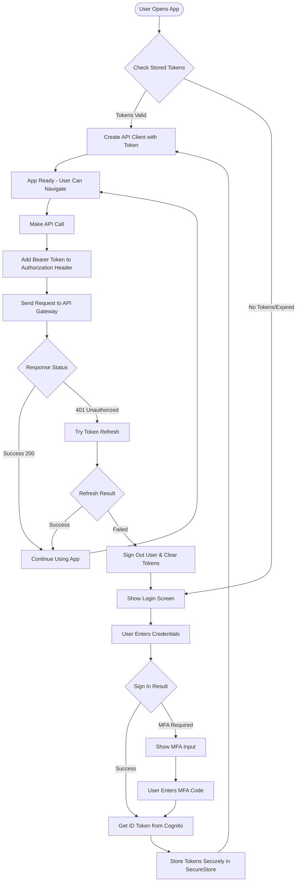
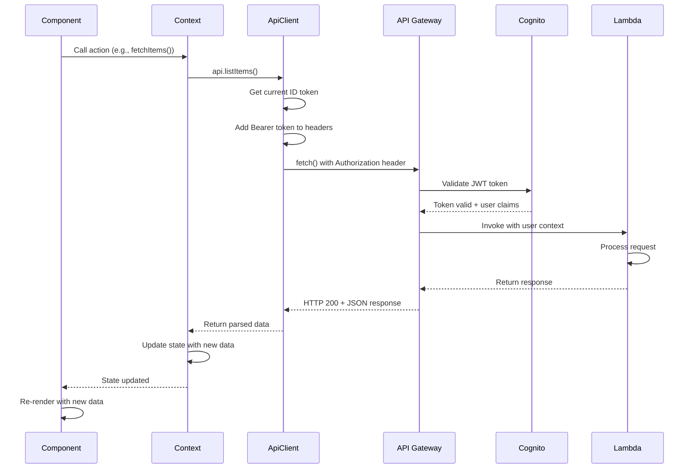

# API Integration

## Overview

This document describes the pattern for integrating with the AWS backend API, including authentication, request signing, error handling, retry logic, and integration with contexts.

## Table of Contents

- [Authentication with Cognito](#authentication-with-cognito)
  - [Authentication Setup](#authentication-setup)
  - [Sign Up Flow](#sign-up-flow)
  - [Sign In Flow](#sign-in-flow)
  - [Session Management](#session-management)
  - [Token Storage](#token-storage)
  - [Password Management](#password-management)
  - [Authentication Context Integration](#authentication-context-integration)
- [API Client Architecture](#api-client-architecture)
- [API Authentication with Bearer Token](#api-authentication-with-bearer-token)
- [Request/Response Types](#requestresponse-types)
- [Error Handling](#error-handling)
- [Retry Logic](#retry-logic)
- [Caching Strategies](#caching-strategies)
- [Integration with Contexts](#integration-with-contexts)
- [Complete Examples](#complete-examples)
- [Best Practices](#best-practices)
- [Authentication Flow Summary](#authentication-flow-summary)
- [API Call Flow](#api-call-flow)

## Authentication with Cognito

### File Structure

Here's how to organize your authentication and API integration code:

```text
app/
├── services/
│   └── auth/
│       ├── signup.ts          # Sign up & verification
│       ├── signin.ts          # Sign in & MFA
│       ├── session.ts         # Session management
│       ├── storage.ts         # Secure token storage
│       ├── password.ts        # Password management
│       ├── credentials.ts     # AWS credential exchange (IAM only)
│       └── CredentialManager.ts # Credential caching (IAM only)
├── utils/
│   └── api/
│       ├── ApiClient.ts       # HTTP client with auth
│       ├── ApiError.ts        # Error class
│       ├── DataApi.ts         # Type-safe API methods
│       ├── errorHandling.ts   # Error utilities
│       ├── retry.ts           # Retry logic
│       └── cache.ts           # Response caching
├── config/
│   └── cognito.ts             # Cognito User Pool config
├── contexts/
│   ├── AuthContext/
│   │   ├── context.ts         # React context
│   │   ├── state.ts           # State interface
│   │   ├── actions.ts         # Action functions
│   │   └── Provider.tsx       # Context provider
│   └── DataContext/
│       ├── context.ts
│       ├── state.ts
│       ├── actions.ts
│       └── Provider.tsx
└── types/
    └── api.ts                 # API request/response types
```

### Authentication Setup

#### Installation

```bash
npm install amazon-cognito-identity-js expo-secure-store @aws-sdk/client-cognito-identity
```

#### Configure Cognito User Pool

```typescript
// config/cognito.ts
import {
  CognitoUserPool,
  CognitoUserAttribute,
  CognitoUser,
  AuthenticationDetails,
  CognitoRefreshToken,
} from 'amazon-cognito-identity-js';

const poolData = {
  UserPoolId: process.env.EXPO_PUBLIC_USER_POOL_ID!,
  ClientId: process.env.EXPO_PUBLIC_USER_POOL_CLIENT_ID!,
};

export const userPool = new CognitoUserPool(poolData);

/**
 * Get a CognitoUser instance
 */
export function getCognitoUser(username: string): CognitoUser {
  return new CognitoUser({
    Username: username,
    Pool: userPool,
  });
}
```

### Sign Up Flow

```typescript
// services/auth/signup.ts
import { CognitoUserAttribute } from 'amazon-cognito-identity-js';
import { userPool } from '@/config/cognito';

export interface SignUpParams {
  username: string;
  password: string;
  email: string;
  phoneNumber?: string;
}

export interface SignUpResult {
  userSub: string;
  userConfirmed: boolean;
}

/**
 * Register a new user
 */
export const signUp = (params: SignUpParams): Promise<SignUpResult> => {
  return new Promise((resolve, reject) => {
    const { username, password, email, phoneNumber } = params;

    const attributes = [
      new CognitoUserAttribute({
        Name: 'email',
        Value: email,
      }),
    ];

    if (phoneNumber) {
      attributes.push(
        new CognitoUserAttribute({
          Name: 'phone_number',
          Value: phoneNumber,
        })
      );
    }

    userPool.signUp(
      username,
      password,
      attributes,
      null,
      (err, result) => {
        if (err) {
          reject(err);
          return;
        }

        if (!result) {
          reject(new Error('Sign up failed'));
          return;
        }

        resolve({
          userSub: result.userSub,
          userConfirmed: result.userConfirmed,
        });
      }
    );
  });
};

/**
 * Confirm user registration with verification code
 */
export const confirmSignUp = (
  username: string,
  code: string
): Promise<void> => {
  return new Promise((resolve, reject) => {
    const cognitoUser = getCognitoUser(username);

    cognitoUser.confirmRegistration(code, true, (err) => {
      if (err) {
        reject(err);
        return;
      }
      resolve();
    });
  });
};

/**
 * Resend verification code
 */
export const resendConfirmationCode = (username: string): Promise<void> => {
  return new Promise((resolve, reject) => {
    const cognitoUser = getCognitoUser(username);

    cognitoUser.resendConfirmationCode((err) => {
      if (err) {
        reject(err);
        return;
      }
      resolve();
    });
  });
};
```

### Sign In Flow

```typescript
// services/auth/signin.ts
import { AuthenticationDetails, CognitoUser } from 'amazon-cognito-identity-js';
import { getCognitoUser } from '@/config/cognito';

export interface SignInResult {
  accessToken: string;
  idToken: string;
  refreshToken: string;
}

export interface SignInChallenge {
  challengeName: 'SMS_MFA' | 'NEW_PASSWORD_REQUIRED';
  user: CognitoUser;
  userAttributes?: any;
  requiredAttributes?: string[];
}

/**
 * Sign in with username and password
 */
export const signIn = (
  username: string,
  password: string
): Promise<SignInResult | SignInChallenge> => {
  return new Promise((resolve, reject) => {
    const authenticationDetails = new AuthenticationDetails({
      Username: username,
      Password: password,
    });

    const cognitoUser = getCognitoUser(username);

    cognitoUser.authenticateUser(authenticationDetails, {
      onSuccess: (result) => {
        resolve({
          accessToken: result.getAccessToken().getJwtToken(),
          idToken: result.getIdToken().getJwtToken(),
          refreshToken: result.getRefreshToken().getToken(),
        });
      },

      onFailure: (err) => {
        reject(err);
      },

      mfaRequired: () => {
        resolve({
          challengeName: 'SMS_MFA',
          user: cognitoUser,
        });
      },

      newPasswordRequired: (userAttributes, requiredAttributes) => {
        // Remove non-mutable attributes
        delete userAttributes.email_verified;
        delete userAttributes.phone_number_verified;

        resolve({
          challengeName: 'NEW_PASSWORD_REQUIRED',
          user: cognitoUser,
          userAttributes,
          requiredAttributes,
        });
      },
    });
  });
};

/**
 * Complete MFA challenge
 */
export const confirmMFA = (
  cognitoUser: CognitoUser,
  code: string
): Promise<SignInResult> => {
  return new Promise((resolve, reject) => {
    cognitoUser.sendMFACode(
      code,
      {
        onSuccess: (result) => {
          resolve({
            accessToken: result.getAccessToken().getJwtToken(),
            idToken: result.getIdToken().getJwtToken(),
            refreshToken: result.getRefreshToken().getToken(),
          });
        },
        onFailure: (err) => {
          reject(err);
        },
      },
      'SMS_MFA'
    );
  });
};

/**
 * Complete new password required challenge
 */
export const completeNewPassword = (
  cognitoUser: CognitoUser,
  newPassword: string,
  userAttributes?: any
): Promise<SignInResult> => {
  return new Promise((resolve, reject) => {
    cognitoUser.completeNewPasswordChallenge(
      newPassword,
      userAttributes || {},
      {
        onSuccess: (result) => {
          resolve({
            accessToken: result.getAccessToken().getJwtToken(),
            idToken: result.getIdToken().getJwtToken(),
            refreshToken: result.getRefreshToken().getToken(),
          });
        },
        onFailure: (err) => {
          reject(err);
        },
      }
    );
  });
};

/**
 * Sign out the current user
 */
export const signOut = (): Promise<void> => {
  return new Promise((resolve) => {
    const cognitoUser = userPool.getCurrentUser();

    if (cognitoUser) {
      cognitoUser.signOut();
    }

    resolve();
  });
};
```

### Session Management

```typescript
// services/auth/session.ts
import { CognitoRefreshToken } from 'amazon-cognito-identity-js';
import { userPool } from '@/config/cognito';

export interface UserSession {
  accessToken: string;
  idToken: string;
  refreshToken: string;
  isValid: boolean;
}

/**
 * Get the current user session
 */
export const getCurrentSession = (): Promise<UserSession> => {
  return new Promise((resolve, reject) => {
    const cognitoUser = userPool.getCurrentUser();

    if (!cognitoUser) {
      reject(new Error('No user logged in'));
      return;
    }

    cognitoUser.getSession((err: any, session: any) => {
      if (err) {
        reject(err);
        return;
      }

      if (!session || !session.isValid()) {
        reject(new Error('Session is invalid'));
        return;
      }

      resolve({
        accessToken: session.getAccessToken().getJwtToken(),
        idToken: session.getIdToken().getJwtToken(),
        refreshToken: session.getRefreshToken().getToken(),
        isValid: session.isValid(),
      });
    });
  });
};

/**
 * Refresh the user session using refresh token
 */
export const refreshSession = (refreshToken: string): Promise<UserSession> => {
  return new Promise((resolve, reject) => {
    const cognitoUser = userPool.getCurrentUser();

    if (!cognitoUser) {
      reject(new Error('No user logged in'));
      return;
    }

    const refreshTokenObj = new CognitoRefreshToken({
      RefreshToken: refreshToken,
    });

    cognitoUser.refreshSession(refreshTokenObj, (err, session) => {
      if (err) {
        reject(err);
        return;
      }

      resolve({
        accessToken: session.getAccessToken().getJwtToken(),
        idToken: session.getIdToken().getJwtToken(),
        refreshToken: session.getRefreshToken().getToken(),
        isValid: session.isValid(),
      });
    });
  });
};

/**
 * Get user attributes
 */
export const getUserAttributes = (): Promise<Record<string, string>> => {
  return new Promise((resolve, reject) => {
    const cognitoUser = userPool.getCurrentUser();

    if (!cognitoUser) {
      reject(new Error('No user logged in'));
      return;
    }

    cognitoUser.getSession((err: any, session: any) => {
      if (err) {
        reject(err);
        return;
      }

      cognitoUser.getUserAttributes((err, attributes) => {
        if (err) {
          reject(err);
          return;
        }

        const attributesObj = attributes?.reduce((acc, attr) => {
          acc[attr.Name] = attr.Value;
          return acc;
        }, {} as Record<string, string>);

        resolve(attributesObj || {});
      });
    });
  });
};

/**
 * Check if a user is currently logged in
 */
export const isUserLoggedIn = (): boolean => {
  const cognitoUser = userPool.getCurrentUser();
  return cognitoUser !== null;
};
```

### Token Storage

```typescript
// services/auth/storage.ts
import * as SecureStore from 'expo-secure-store';

const TOKENS_KEY = '@auth_tokens';
const USER_INFO_KEY = '@user_info';

export interface StoredTokens {
  accessToken: string;
  idToken: string;
  refreshToken: string;
  expiresAt: number;
}

export interface StoredUserInfo {
  email: string;
  sub: string;
}

/**
 * Store authentication tokens securely
 */
export const storeTokens = async (tokens: StoredTokens): Promise<void> => {
  await SecureStore.setItemAsync(TOKENS_KEY, JSON.stringify(tokens));
};

/**
 * Get stored authentication tokens
 */
export const getStoredTokens = async (): Promise<StoredTokens | null> => {
  const tokensJson = await SecureStore.getItemAsync(TOKENS_KEY);
  
  if (!tokensJson) {
    return null;
  }

  try {
    return JSON.parse(tokensJson);
  } catch {
    return null;
  }
};

/**
 * Clear stored authentication tokens
 */
export const clearTokens = async (): Promise<void> => {
  await SecureStore.deleteItemAsync(TOKENS_KEY);
  await SecureStore.deleteItemAsync(USER_INFO_KEY);
};

/**
 * Store user information
 */
export const storeUserInfo = async (userInfo: StoredUserInfo): Promise<void> => {
  await SecureStore.setItemAsync(USER_INFO_KEY, JSON.stringify(userInfo));
};

/**
 * Get stored user information
 */
export const getStoredUserInfo = async (): Promise<StoredUserInfo | null> => {
  const userInfoJson = await SecureStore.getItemAsync(USER_INFO_KEY);
  
  if (!userInfoJson) {
    return null;
  }

  try {
    return JSON.parse(userInfoJson);
  } catch {
    return null;
  }
};

/**
 * Check if stored tokens are expired
 */
export const areTokensExpired = async (): Promise<boolean> => {
  const tokens = await getStoredTokens();
  
  if (!tokens) {
    return true;
  }

  return Date.now() >= tokens.expiresAt;
};
```

### Password Management

```typescript
// services/auth/password.ts
import { getCognitoUser, userPool } from '@/config/cognito';

/**
 * Initiate forgot password flow
 */
export const forgotPassword = (username: string): Promise<void> => {
  return new Promise((resolve, reject) => {
    const cognitoUser = getCognitoUser(username);

    cognitoUser.forgotPassword({
      onSuccess: () => {
        resolve();
      },
      onFailure: (err) => {
        reject(err);
      },
    });
  });
};

/**
 * Confirm new password with verification code
 */
export const confirmPassword = (
  username: string,
  code: string,
  newPassword: string
): Promise<void> => {
  return new Promise((resolve, reject) => {
    const cognitoUser = getCognitoUser(username);

    cognitoUser.confirmPassword(code, newPassword, {
      onSuccess: () => {
        resolve();
      },
      onFailure: (err) => {
        reject(err);
      },
    });
  });
};

/**
 * Change password for authenticated user
 */
export const changePassword = (
  oldPassword: string,
  newPassword: string
): Promise<void> => {
  return new Promise((resolve, reject) => {
    const cognitoUser = userPool.getCurrentUser();

    if (!cognitoUser) {
      reject(new Error('No user logged in'));
      return;
    }

    cognitoUser.getSession((err: any, session: any) => {
      if (err) {
        reject(err);
        return;
      }

      cognitoUser.changePassword(oldPassword, newPassword, (err) => {
        if (err) {
          reject(err);
          return;
        }
        resolve();
      });
    });
  });
};
```

### Authentication Context Integration

```typescript
// contexts/AuthContext/state.ts
import { CognitoUser } from 'amazon-cognito-identity-js';

export interface AuthState {
  isAuthenticated: boolean;
  isLoading: boolean;
  user: {
    email: string;
    sub: string;
  } | null;
  tokens: {
    accessToken: string;
    idToken: string;
    refreshToken: string;
  } | null;
  error: string | null;
  // For MFA flow
  pendingMFA: {
    user: CognitoUser;
  } | null;
}

export const initialAuthState: AuthState = {
  isAuthenticated: false,
  isLoading: true,
  user: null,
  tokens: null,
  error: null,
  pendingMFA: null,
};
```

```typescript
// contexts/AuthContext/actions.ts
import * as authService from '@/services/auth';
import { storeTokens, clearTokens, storeUserInfo } from '@/services/auth/storage';
import { AuthState, initialAuthState } from './state';
import { SignUpParams } from '@/services/auth/signup';

export interface AuthActions {
  signUp: (params: SignUpParams) => Promise<void>;
  confirmSignUp: (username: string, code: string) => Promise<void>;
  signIn: (username: string, password: string) => Promise<void>;
  confirmMFA: (code: string) => Promise<void>;
  signOut: () => Promise<void>;
  refreshSession: () => Promise<void>;
  forgotPassword: (username: string) => Promise<void>;
  confirmPassword: (username: string, code: string, newPassword: string) => Promise<void>;
}

export function createAuthActions(
  state: AuthState,
  setState: (state: AuthState) => void
): AuthActions {
  return {
    signUp: async (params) => {
      setState({ ...state, isLoading: true, error: null });
      
      try {
        await authService.signUp(params);
        // User needs to confirm email
        setState({
          ...state,
          isLoading: false,
        });
      } catch (error) {
        setState({
          ...state,
          isLoading: false,
          error: error instanceof Error ? error.message : 'Sign up failed',
        });
        throw error;
      }
    },

    confirmSignUp: async (username, code) => {
      setState({ ...state, isLoading: true, error: null });
      
      try {
        await authService.confirmSignUp(username, code);
        setState({
          ...state,
          isLoading: false,
        });
      } catch (error) {
        setState({
          ...state,
          isLoading: false,
          error: error instanceof Error ? error.message : 'Confirmation failed',
        });
        throw error;
      }
    },

    signIn: async (username, password) => {
      setState({ ...state, isLoading: true, error: null });
      
      try {
        const result = await authService.signIn(username, password);

        if ('challengeName' in result) {
          // Handle MFA or new password required
          if (result.challengeName === 'SMS_MFA') {
            setState({
              ...state,
              isLoading: false,
              pendingMFA: { user: result.user },
            });
          }
          return;
        }

        // Sign in successful
        const userAttributes = await authService.getUserAttributes();
        
        await storeTokens({
          accessToken: result.accessToken,
          idToken: result.idToken,
          refreshToken: result.refreshToken,
          expiresAt: Date.now() + 3600000, // 1 hour
        });

        await storeUserInfo({
          email: userAttributes.email,
          sub: userAttributes.sub,
        });

        setState({
          ...state,
          isAuthenticated: true,
          isLoading: false,
          user: {
            email: userAttributes.email,
            sub: userAttributes.sub,
          },
          tokens: result,
          error: null,
        });
      } catch (error) {
        setState({
          ...state,
          isLoading: false,
          error: error instanceof Error ? error.message : 'Sign in failed',
        });
        throw error;
      }
    },

    confirmMFA: async (code) => {
      if (!state.pendingMFA) {
        throw new Error('No pending MFA challenge');
      }

      setState({ ...state, isLoading: true, error: null });
      
      try {
        const result = await authService.confirmMFA(state.pendingMFA.user, code);
        const userAttributes = await authService.getUserAttributes();

        await storeTokens({
          accessToken: result.accessToken,
          idToken: result.idToken,
          refreshToken: result.refreshToken,
          expiresAt: Date.now() + 3600000,
        });

        setState({
          ...state,
          isAuthenticated: true,
          isLoading: false,
          user: {
            email: userAttributes.email,
            sub: userAttributes.sub,
          },
          tokens: result,
          pendingMFA: null,
          error: null,
        });
      } catch (error) {
        setState({
          ...state,
          isLoading: false,
          error: error instanceof Error ? error.message : 'MFA verification failed',
        });
        throw error;
      }
    },

    signOut: async () => {
      setState({ ...state, isLoading: true });
      
      try {
        await authService.signOut();
        await clearTokens();
        
        setState({
          ...initialAuthState,
          isLoading: false,
        });
      } catch (error) {
        setState({
          ...state,
          isLoading: false,
          error: error instanceof Error ? error.message : 'Sign out failed',
        });
      }
    },

    refreshSession: async () => {
      if (!state.tokens?.refreshToken) {
        throw new Error('No refresh token available');
      }

      try {
        const result = await authService.refreshSession(state.tokens.refreshToken);
        
        await storeTokens({
          accessToken: result.accessToken,
          idToken: result.idToken,
          refreshToken: result.refreshToken,
          expiresAt: Date.now() + 3600000,
        });

        setState({
          ...state,
          tokens: result,
        });
      } catch (error) {
        // Refresh failed, sign out
        await this.signOut();
        throw error;
      }
    },

    forgotPassword: async (username) => {
      setState({ ...state, isLoading: true, error: null });
      
      try {
        await authService.forgotPassword(username);
        setState({
          ...state,
          isLoading: false,
        });
      } catch (error) {
        setState({
          ...state,
          isLoading: false,
          error: error instanceof Error ? error.message : 'Forgot password failed',
        });
        throw error;
      }
    },

    confirmPassword: async (username, code, newPassword) => {
      setState({ ...state, isLoading: true, error: null });
      
      try {
        await authService.confirmPassword(username, code, newPassword);
        setState({
          ...state,
          isLoading: false,
        });
      } catch (error) {
        setState({
          ...state,
          isLoading: false,
          error: error instanceof Error ? error.message : 'Password reset failed',
        });
        throw error;
      }
    },
  };
}
```

## API Client Architecture

### Basic Structure

```typescript
// utils/api/ApiClient.ts
import { SignatureV4 } from '@aws-sdk/signature-v4';
import { Sha256 } from '@aws-crypto/sha256-js';
import { HttpRequest } from '@aws-sdk/protocol-http';

export interface ApiConfig {
  /** API Gateway endpoint URL */
  baseUrl: string;
  /** AWS region */
  region: string;
  /** AWS credentials */
  credentials: {
    accessKeyId: string;
    secretAccessKey: string;
    sessionToken?: string;
  };
}

export interface RequestOptions {
  method?: 'GET' | 'POST' | 'PUT' | 'DELETE' | 'PATCH';
  headers?: Record<string, string>;
  body?: any;
  params?: Record<string, string>;
}

export interface ApiResponse<T> {
  data: T;
  status: number;
  headers: Record<string, string>;
}

/**
 * API Client for making authenticated requests to AWS API Gateway
 */
export class ApiClient {
  private readonly config: ApiConfig;
  private readonly signer: SignatureV4;

  constructor(config: ApiConfig) {
    this.config = config;
    this.signer = new SignatureV4({
      service: 'execute-api',
      region: config.region,
      credentials: config.credentials,
      sha256: Sha256,
    });
  }

  /**
   * Make a signed request to the API
   */
  async request<T>(
    endpoint: string,
    options: RequestOptions = {}
  ): Promise<ApiResponse<T>> {
    const {
      method = 'GET',
      headers = {},
      body,
      params,
    } = options;

    // Build URL with query parameters
    const url = this.buildUrl(endpoint, params);

    // Create HTTP request
    const request = new HttpRequest({
      method,
      protocol: 'https:',
      hostname: new URL(this.config.baseUrl).hostname,
      path: url,
      headers: {
        'Content-Type': 'application/json',
        ...headers,
      },
      body: body ? JSON.stringify(body) : undefined,
    });

    // Sign the request
    const signedRequest = await this.signer.sign(request);

    // Make the request
    const response = await fetch(`${this.config.baseUrl}${url}`, {
      method: signedRequest.method,
      headers: signedRequest.headers as Record<string, string>,
      body: signedRequest.body as string | undefined,
    });

    // Handle response
    return this.handleResponse<T>(response);
  }

  /**
   * GET request
   */
  async get<T>(endpoint: string, params?: Record<string, string>): Promise<ApiResponse<T>> {
    return this.request<T>(endpoint, { method: 'GET', params });
  }

  /**
   * POST request
   */
  async post<T>(endpoint: string, body: any): Promise<ApiResponse<T>> {
    return this.request<T>(endpoint, { method: 'POST', body });
  }

  /**
   * PUT request
   */
  async put<T>(endpoint: string, body: any): Promise<ApiResponse<T>> {
    return this.request<T>(endpoint, { method: 'PUT', body });
  }

  /**
   * DELETE request
   */
  async delete<T>(endpoint: string): Promise<ApiResponse<T>> {
    return this.request<T>(endpoint, { method: 'DELETE' });
  }

  /**
   * Build URL with query parameters
   */
  private buildUrl(endpoint: string, params?: Record<string, string>): string {
    if (!params) return endpoint;

    const queryString = Object.entries(params)
      .map(([key, value]) => `${encodeURIComponent(key)}=${encodeURIComponent(value)}`)
      .join('&');

    return `${endpoint}?${queryString}`;
  }

  /**
   * Handle API response
   */
  private async handleResponse<T>(response: Response): Promise<ApiResponse<T>> {
    const headers: Record<string, string> = {};
    response.headers.forEach((value, key) => {
      headers[key] = value;
    });

    let data: T;
    const contentType = response.headers.get('content-type');
    
    if (contentType?.includes('application/json')) {
      data = await response.json();
    } else {
      data = (await response.text()) as any;
    }

    if (!response.ok) {
      throw new ApiError(
        (data as any)?.message || `Request failed with status ${response.status}`,
        response.status,
        data
      );
    }

    return {
      data,
      status: response.status,
      headers,
    };
  }
}
```

### API Error Class

```typescript
// utils/api/ApiError.ts

export class ApiError extends Error {
  constructor(
    message: string,
    public readonly status: number,
    public readonly data?: any,
    public readonly code?: string
  ) {
    super(message);
    this.name = 'ApiError';
  }

  /**
   * Check if error is a specific HTTP status
   */
  isStatus(status: number): boolean {
    return this.status === status;
  }

  /**
   * Check if error is a 4xx client error
   */
  isClientError(): boolean {
    return this.status >= 400 && this.status < 500;
  }

  /**
   * Check if error is a 5xx server error
   */
  isServerError(): boolean {
    return this.status >= 500 && this.status < 600;
  }
}
```

## API Authentication with Bearer Token

This implementation uses Bearer Token authentication, where you send the Cognito ID token directly to API Gateway. This is the recommended approach for most mobile applications.

### Benefits of Bearer Token Authentication

- ✅ **Simple** - No additional AWS services required
- ✅ **Fast** - Direct token validation by API Gateway
- ✅ **Secure** - Tokens are short-lived and cryptographically signed
- ✅ **Scalable** - API Gateway handles validation automatically
- ✅ **No credentials** - No need to manage AWS credentials client-side

#### Configure API Gateway

Your API Gateway must be configured with a Cognito User Pool Authorizer:

```typescript
// In CDK stack
import { CognitoUserPoolsAuthorizer } from 'aws-cdk-lib/aws-apigateway';

const authorizer = new CognitoUserPoolsAuthorizer(this, 'Authorizer', {
  cognitoUserPools: [userPool],
});

// Add to routes
api.root.addMethod('GET', lambdaIntegration, {
  authorizer,
  authorizationType: AuthorizationType.COGNITO,
});
```

#### Make Authenticated Requests

```typescript
// utils/api/ApiClient.ts
export interface ApiConfig {
  baseUrl: string;
}

export class ApiClient {
  constructor(
    private readonly config: ApiConfig,
    private readonly getIdToken: () => Promise<string>
  ) {}

  async request<T>(
    endpoint: string,
    options: RequestOptions = {}
  ): Promise<ApiResponse<T>> {
    const { method = 'GET', headers = {}, body, params } = options;

    // Get current ID token
    const idToken = await this.getIdToken();

    // Build URL
    const url = this.buildUrl(endpoint, params);

    // Make request with Bearer token
    const response = await fetch(`${this.config.baseUrl}${url}`, {
      method,
      headers: {
        'Content-Type': 'application/json',
        'Authorization': `Bearer ${idToken}`,
        ...headers,
      },
      body: body ? JSON.stringify(body) : undefined,
    });

    return this.handleResponse<T>(response);
  }

  // ... other methods (get, post, put, delete)
  // ... buildUrl, handleResponse (same as before)
}
```

## Request/Response Types

### Defining API Types

```typescript
// types/api.ts

/**
 * Base response structure
 */
export interface ApiBaseResponse {
  success: boolean;
  message?: string;
}

/**
 * Paginated response
 */
export interface PaginatedResponse<T> {
  items: T[];
  nextToken?: string;
  total?: number;
}

/**
 * Data item from API
 */
export interface DataItem {
  id: string;
  title: string;
  description: string;
  createdAt: string;
  updatedAt: string;
}

/**
 * Request to create data item
 */
export interface CreateDataRequest {
  title: string;
  description: string;
}

/**
 * Request to update data item
 */
export interface UpdateDataRequest {
  title?: string;
  description?: string;
}

/**
 * List data items request
 */
export interface ListDataRequest {
  limit?: number;
  nextToken?: string;
  filter?: string;
}
```

### Type-Safe API Methods

```typescript
// utils/api/DataApi.ts
import { ApiClient } from './ApiClient';
import { DataItem, CreateDataRequest, UpdateDataRequest, ListDataRequest, PaginatedResponse } from '@/types/api';

export class DataApi {
  constructor(private readonly client: ApiClient) {}

  /**
   * List all data items
   */
  async listItems(request: ListDataRequest = {}): Promise<PaginatedResponse<DataItem>> {
    const { data } = await this.client.get<PaginatedResponse<DataItem>>('/items', {
      limit: request.limit?.toString(),
      nextToken: request.nextToken,
      filter: request.filter,
    });
    return data;
  }

  /**
   * Get a single data item
   */
  async getItem(id: string): Promise<DataItem> {
    const { data } = await this.client.get<DataItem>(`/items/${id}`);
    return data;
  }

  /**
   * Create a new data item
   */
  async createItem(request: CreateDataRequest): Promise<DataItem> {
    const { data } = await this.client.post<DataItem>('/items', request);
    return data;
  }

  /**
   * Update an existing data item
   */
  async updateItem(id: string, request: UpdateDataRequest): Promise<DataItem> {
    const { data } = await this.client.put<DataItem>(`/items/${id}`, request);
    return data;
  }

  /**
   * Delete a data item
   */
  async deleteItem(id: string): Promise<void> {
    await this.client.delete(`/items/${id}`);
  }
}
```

## Error Handling

### Error Handling Patterns

```typescript
// utils/api/errorHandling.ts

/**
 * Handle API errors with user-friendly messages
 */
export function getErrorMessage(error: unknown): string {
  if (error instanceof ApiError) {
    switch (error.status) {
      case 400:
        return error.message || 'Invalid request. Please check your input.';
      case 401:
        return 'You are not authenticated. Please log in.';
      case 403:
        return 'You do not have permission to perform this action.';
      case 404:
        return 'The requested resource was not found.';
      case 409:
        return 'This resource already exists or conflicts with another.';
      case 429:
        return 'Too many requests. Please try again later.';
      case 500:
        return 'A server error occurred. Please try again.';
      case 503:
        return 'The service is temporarily unavailable. Please try again.';
      default:
        return error.message || 'An unexpected error occurred.';
    }
  }

  if (error instanceof Error) {
    return error.message;
  }

  return 'An unexpected error occurred.';
}

/**
 * Check if error should trigger logout
 */
export function shouldLogout(error: unknown): boolean {
  return error instanceof ApiError && error.status === 401;
}

/**
 * Check if error is retryable
 */
export function isRetryable(error: unknown): boolean {
  if (!(error instanceof ApiError)) return false;
  
  // Retry on 5xx errors and 429 (rate limit)
  return error.isServerError() || error.status === 429;
}
```

### Error Handling in Components

```typescript
// components/DataList.tsx
import { getErrorMessage, shouldLogout } from '@/utils/api/errorHandling';

export function DataList() {
  const { state, actions } = useDataContext();
  const { actions: authActions } = useAuthContext();

  const handleRetry = async () => {
    try {
      await actions.fetchItems();
    } catch (error) {
      if (shouldLogout(error)) {
        await authActions.logout();
      }
    }
  };

  if (state.error) {
    return (
      <ErrorMessage
        message={getErrorMessage(state.error)}
        onRetry={handleRetry}
      />
    );
  }

  // ... render list
}
```

## Retry Logic

### Retry with Exponential Backoff

```typescript
// utils/api/retry.ts

export interface RetryOptions {
  /** Maximum number of retry attempts */
  maxAttempts?: number;
  /** Initial delay in milliseconds */
  initialDelay?: number;
  /** Maximum delay in milliseconds */
  maxDelay?: number;
  /** Backoff multiplier */
  backoffMultiplier?: number;
}

/**
 * Retry a function with exponential backoff
 */
export async function retryWithBackoff<T>(
  fn: () => Promise<T>,
  options: RetryOptions = {}
): Promise<T> {
  const {
    maxAttempts = 3,
    initialDelay = 1000,
    maxDelay = 10000,
    backoffMultiplier = 2,
  } = options;

  let attempt = 0;
  let delay = initialDelay;

  while (true) {
    try {
      return await fn();
    } catch (error) {
      attempt++;

      // Don't retry if max attempts reached
      if (attempt >= maxAttempts) {
        throw error;
      }

      // Don't retry if error is not retryable
      if (!isRetryable(error)) {
        throw error;
      }

      // Wait before retrying
      await new Promise(resolve => setTimeout(resolve, delay));

      // Increase delay for next attempt
      delay = Math.min(delay * backoffMultiplier, maxDelay);
    }
  }
}
```

### API Client with Retry

```typescript
export class ApiClient {
  // ... existing code

  /**
   * Make a request with automatic retry
   */
  async requestWithRetry<T>(
    endpoint: string,
    options: RequestOptions = {},
    retryOptions?: RetryOptions
  ): Promise<ApiResponse<T>> {
    return retryWithBackoff(
      () => this.request<T>(endpoint, options),
      retryOptions
    );
  }
}
```

## Caching Strategies

### Simple In-Memory Cache

```typescript
// utils/api/cache.ts

export interface CacheEntry<T> {
  data: T;
  timestamp: number;
  expiresAt: number;
}

export class ApiCache {
  private cache = new Map<string, CacheEntry<any>>();

  /**
   * Get cached data if still valid
   */
  get<T>(key: string): T | null {
    const entry = this.cache.get(key);
    
    if (!entry) return null;
    
    if (Date.now() > entry.expiresAt) {
      this.cache.delete(key);
      return null;
    }
    
    return entry.data;
  }

  /**
   * Set cache entry
   */
  set<T>(key: string, data: T, ttlMs: number = 60000): void {
    this.cache.set(key, {
      data,
      timestamp: Date.now(),
      expiresAt: Date.now() + ttlMs,
    });
  }

  /**
   * Clear cache entry
   */
  delete(key: string): void {
    this.cache.delete(key);
  }

  /**
   * Clear all cache
   */
  clear(): void {
    this.cache.clear();
  }
}
```

### API Client with Cache

```typescript
export class DataApi {
  private cache = new ApiCache();

  constructor(private readonly client: ApiClient) {}

  async listItems(request: ListDataRequest = {}, useCache = true): Promise<PaginatedResponse<DataItem>> {
    const cacheKey = `items:${JSON.stringify(request)}`;
    
    if (useCache) {
      const cached = this.cache.get<PaginatedResponse<DataItem>>(cacheKey);
      if (cached) return cached;
    }

    const { data } = await this.client.get<PaginatedResponse<DataItem>>('/items', request);
    
    this.cache.set(cacheKey, data, 60000); // Cache for 1 minute
    
    return data;
  }

  async createItem(request: CreateDataRequest): Promise<DataItem> {
    const { data } = await this.client.post<DataItem>('/items', request);
    
    // Invalidate list cache
    this.cache.clear();
    
    return data;
  }
}
```

## Integration with Contexts

### Auth Context Provider

```typescript
// contexts/AuthContext/Provider.tsx
import React, { useState, useEffect, useMemo } from 'react';
import { AuthContext } from './context';
import { AuthState, initialAuthState } from './state';
import { createAuthActions } from './actions';
import { getCurrentSession } from '@/services/auth/session';
import { getStoredTokens, getStoredUserInfo } from '@/services/auth/storage';

export function AuthProvider({ children }: { children: React.ReactNode }) {
  const [state, setState] = useState<AuthState>(initialAuthState);

  // Create actions with current state
  const actions = useMemo(
    () => createAuthActions(state, setState),
    [state]
  );

  // Restore session on mount
  useEffect(() => {
    const restoreSession = async () => {
      try {
        // Try to get stored tokens
        const tokens = await getStoredTokens();
        const userInfo = await getStoredUserInfo();

        if (!tokens || !userInfo) {
          setState({ ...initialAuthState, isLoading: false });
          return;
        }

        // Verify session is still valid
        const session = await getCurrentSession();

        setState({
          ...state,
          isAuthenticated: true,
          isLoading: false,
          user: userInfo,
          tokens: {
            accessToken: session.accessToken,
            idToken: session.idToken,
            refreshToken: session.refreshToken,
          },
        });
      } catch (error) {
        // Session restoration failed
        setState({ ...initialAuthState, isLoading: false });
      }
    };

    restoreSession();
  }, []);

  return (
    <AuthContext.Provider value={{ state, actions }}>
      {children}
    </AuthContext.Provider>
  );
}
```

### Data Context with API Integration

```typescript
// contexts/DataContext/Provider.tsx
import React, { useState, useMemo, useCallback } from 'react';
import { DataApi } from '@/utils/api/DataApi';
import { ApiClient } from '@/utils/api/ApiClient';
import { useAuthContext } from '@/contexts/AuthContext';
import { getCurrentSession } from '@/services/auth/session';
import { DataState } from './state';
import { DataContext } from './context';
import { getErrorMessage, shouldLogout } from '@/utils/api/errorHandling';
import { CreateDataRequest } from '@/types/api';

export function DataProvider({ children }: { children: React.ReactNode }) {
  const { state: authState, actions: authActions } = useAuthContext();
  const [state, setState] = useState<DataState>({
    loading: false,
    items: [],
    error: null,
  });

  // Create API client that uses ID token
  const api = useMemo(() => {
    if (!authState.isAuthenticated || !authState.tokens) {
      return null;
    }

    const client = new ApiClient(
      {
        baseUrl: process.env.EXPO_PUBLIC_API_URL!,
      },
      // Pass function to get current ID token
      async () => {
        if (!authState.tokens) {
          throw new Error('No tokens available');
        }

        // Optionally refresh if expired
        try {
          const session = await getCurrentSession();
          return session.idToken;
        } catch (error) {
          // Session expired, refresh it
          await authActions.refreshSession();
          
          // After refresh, state will update and new tokens will be available
          if (!authState.tokens) {
            throw new Error('Failed to refresh session');
          }
          
          return authState.tokens.idToken;
        }
      }
    );

    return new DataApi(client);
  }, [authState.isAuthenticated, authState.tokens]);

  const fetchItems = useCallback(async () => {
    if (!api) {
      setState(prev => ({ ...prev, error: 'Not authenticated' }));
      return;
    }

    setState(prev => ({ ...prev, loading: true, error: null }));

    try {
      const response = await api.listItems();
      setState({
        loading: false,
        items: response.items,
        error: null,
      });
    } catch (error) {
      // Check if we should sign out
      if (shouldLogout(error)) {
        await authActions.signOut();
        return;
      }

      setState({
        loading: false,
        items: [],
        error: getErrorMessage(error),
      });
    }
  }, [api, authActions]);

  const createItem = useCallback(async (data: CreateDataRequest) => {
    if (!api) {
      throw new Error('Not authenticated');
    }

    setState(prev => ({ ...prev, loading: true, error: null }));

    try {
      const newItem = await api.createItem(data);
      setState(prev => ({
        loading: false,
        items: [...prev.items, newItem],
        error: null,
      }));
      return newItem;
    } catch (error) {
      if (shouldLogout(error)) {
        await authActions.signOut();
        throw error;
      }

      setState(prev => ({
        ...prev,
        loading: false,
        error: getErrorMessage(error),
      }));
      throw error;
    }
  }, [api, authActions]);

  // ... other actions

  const contextValue = useMemo(
    () => ({
      state,
      actions: {
        fetchItems,
        createItem,
        // ... other actions
      },
    }),
    [state, fetchItems, createItem]
  );

  return (
    <DataContext.Provider value={contextValue}>
      {children}
    </DataContext.Provider>
  );
}
```

### Protected Route Pattern

```typescript
// components/ProtectedRoute.tsx
import { useAuthContext } from '@/contexts/AuthContext';
import { Redirect } from 'expo-router';
import { View, ActivityIndicator } from 'react-native';

export function ProtectedRoute({ children }: { children: React.ReactNode }) {
  const { state } = useAuthContext();

  if (state.isLoading) {
    return (
      <View style={{ flex: 1, justifyContent: 'center', alignItems: 'center' }}>
        <ActivityIndicator size="large" />
      </View>
    );
  }

  if (!state.isAuthenticated) {
    return <Redirect href="/login" />;
  }

  return <>{children}</>;
}
```

### Using in Screens

```typescript
// app/(tabs)/data.tsx
import { useDataContext } from '@/contexts/DataContext';
import { ProtectedRoute } from '@/components/ProtectedRoute';

export default function DataScreen() {
  const { state, actions } = useDataContext();

  useEffect(() => {
    actions.fetchItems();
  }, []);

  return (
    <ProtectedRoute>
      <View>
        {state.loading && <ActivityIndicator />}
        {state.error && <Text>{state.error}</Text>}
        {state.items.map(item => (
          <Text key={item.id}>{item.title}</Text>
        ))}
      </View>
    </ProtectedRoute>
  );
}
```

## Complete Examples

### Full Authentication Flow

#### Login Screen

```typescript
// app/login.tsx
import React, { useState, useEffect } from 'react';
import { View, TextInput, Button, Text, ActivityIndicator } from 'react-native';
import { useAuthContext } from '@/contexts/AuthContext';
import { router } from 'expo-router';

export default function LoginScreen() {
  const { state, actions } = useAuthContext();
  const [username, setUsername] = useState('');
  const [password, setPassword] = useState('');
  const [mfaCode, setMfaCode] = useState('');

  const handleSignIn = async () => {
    try {
      await actions.signIn(username, password);
      
      // If no MFA required, redirect to home
      if (!state.pendingMFA) {
        router.replace('/(tabs)');
      }
    } catch (error) {
      // Error is already in state.error
      console.error('Sign in failed:', error);
    }
  };

  const handleMFASubmit = async () => {
    try {
      await actions.confirmMFA(mfaCode);
      router.replace('/(tabs)');
    } catch (error) {
      console.error('MFA verification failed:', error);
    }
  };

  // Redirect if already authenticated
  useEffect(() => {
    if (state.isAuthenticated) {
      router.replace('/(tabs)');
    }
  }, [state.isAuthenticated]);

  if (state.isLoading) {
    return (
      <View style={{ flex: 1, justifyContent: 'center', alignItems: 'center' }}>
        <ActivityIndicator size="large" />
      </View>
    );
  }

  // Show MFA screen
  if (state.pendingMFA) {
    return (
      <View style={{ padding: 20 }}>
        <Text>Enter verification code</Text>
        <TextInput
          placeholder="MFA Code"
          value={mfaCode}
          onChangeText={setMfaCode}
          keyboardType="number-pad"
        />
        <Button title="Verify" onPress={handleMFASubmit} />
        {state.error && <Text style={{ color: 'red' }}>{state.error}</Text>}
      </View>
    );
  }

  return (
    <View style={{ padding: 20 }}>
      <Text>Sign In</Text>
      <TextInput
        placeholder="Username or Email"
        value={username}
        onChangeText={setUsername}
        autoCapitalize="none"
        autoCorrect={false}
      />
      <TextInput
        placeholder="Password"
        value={password}
        onChangeText={setPassword}
        secureTextEntry
      />
      <Button title="Sign In" onPress={handleSignIn} />
      <Button
        title="Create Account"
        onPress={() => router.push('/signup')}
      />
      <Button
        title="Forgot Password?"
        onPress={() => router.push('/forgot-password')}
      />
      {state.error && <Text style={{ color: 'red' }}>{state.error}</Text>}
    </View>
  );
}
```

#### Sign Up Screen

```typescript
// app/signup.tsx
import React, { useState } from 'react';
import { View, TextInput, Button, Text } from 'react-native';
import { useAuthContext } from '@/contexts/AuthContext';
import { router } from 'expo-router';

export default function SignUpScreen() {
  const { state, actions } = useAuthContext();
  const [username, setUsername] = useState('');
  const [email, setEmail] = useState('');
  const [password, setPassword] = useState('');
  const [confirmPassword, setConfirmPassword] = useState('');
  const [verificationCode, setVerificationCode] = useState('');
  const [needsVerification, setNeedsVerification] = useState(false);

  const handleSignUp = async () => {
    if (password !== confirmPassword) {
      alert('Passwords do not match');
      return;
    }

    try {
      await actions.signUp({ username, email, password });
      setNeedsVerification(true);
    } catch (error) {
      console.error('Sign up failed:', error);
    }
  };

  const handleVerify = async () => {
    try {
      await actions.confirmSignUp(username, verificationCode);
      alert('Account verified! Please sign in.');
      router.replace('/login');
    } catch (error) {
      console.error('Verification failed:', error);
    }
  };

  if (needsVerification) {
    return (
      <View style={{ padding: 20 }}>
        <Text>Check your email for verification code</Text>
        <TextInput
          placeholder="Verification Code"
          value={verificationCode}
          onChangeText={setVerificationCode}
          keyboardType="number-pad"
        />
        <Button title="Verify" onPress={handleVerify} />
        <Button
          title="Resend Code"
          onPress={() => actions.signUp({ username, email, password })}
        />
        {state.error && <Text style={{ color: 'red' }}>{state.error}</Text>}
      </View>
    );
  }

  return (
    <View style={{ padding: 20 }}>
      <Text>Create Account</Text>
      <TextInput
        placeholder="Username"
        value={username}
        onChangeText={setUsername}
        autoCapitalize="none"
        autoCorrect={false}
      />
      <TextInput
        placeholder="Email"
        value={email}
        onChangeText={setEmail}
        keyboardType="email-address"
        autoCapitalize="none"
        autoCorrect={false}
      />
      <TextInput
        placeholder="Password"
        value={password}
        onChangeText={setPassword}
        secureTextEntry
      />
      <TextInput
        placeholder="Confirm Password"
        value={confirmPassword}
        onChangeText={setConfirmPassword}
        secureTextEntry
      />
      <Button title="Sign Up" onPress={handleSignUp} />
      <Button
        title="Back to Sign In"
        onPress={() => router.back()}
      />
      {state.error && <Text style={{ color: 'red' }}>{state.error}</Text>}
    </View>
  );
}
```

#### Forgot Password Screen

```typescript
// app/forgot-password.tsx
import React, { useState } from 'react';
import { View, TextInput, Button, Text } from 'react-native';
import { useAuthContext } from '@/contexts/AuthContext';
import { router } from 'expo-router';

export default function ForgotPasswordScreen() {
  const { state, actions } = useAuthContext();
  const [username, setUsername] = useState('');
  const [code, setCode] = useState('');
  const [newPassword, setNewPassword] = useState('');
  const [confirmPassword, setConfirmPassword] = useState('');
  const [codeSent, setCodeSent] = useState(false);

  const handleSendCode = async () => {
    try {
      await actions.forgotPassword(username);
      setCodeSent(true);
    } catch (error) {
      console.error('Failed to send code:', error);
    }
  };

  const handleResetPassword = async () => {
    if (newPassword !== confirmPassword) {
      alert('Passwords do not match');
      return;
    }

    try {
      await actions.confirmPassword(username, code, newPassword);
      alert('Password reset successful! Please sign in.');
      router.replace('/login');
    } catch (error) {
      console.error('Password reset failed:', error);
    }
  };

  if (codeSent) {
    return (
      <View style={{ padding: 20 }}>
        <Text>Check your email for reset code</Text>
        <TextInput
          placeholder="Reset Code"
          value={code}
          onChangeText={setCode}
          keyboardType="number-pad"
        />
        <TextInput
          placeholder="New Password"
          value={newPassword}
          onChangeText={setNewPassword}
          secureTextEntry
        />
        <TextInput
          placeholder="Confirm New Password"
          value={confirmPassword}
          onChangeText={setConfirmPassword}
          secureTextEntry
        />
        <Button title="Reset Password" onPress={handleResetPassword} />
        <Button title="Resend Code" onPress={handleSendCode} />
        {state.error && <Text style={{ color: 'red' }}>{state.error}</Text>}
      </View>
    );
  }

  return (
    <View style={{ padding: 20 }}>
      <Text>Reset Password</Text>
      <TextInput
        placeholder="Username or Email"
        value={username}
        onChangeText={setUsername}
        autoCapitalize="none"
        autoCorrect={false}
      />
      <Button title="Send Reset Code" onPress={handleSendCode} />
      <Button title="Back to Sign In" onPress={() => router.back()} />
      {state.error && <Text style={{ color: 'red' }}>{state.error}</Text>}
    </View>
  );
}
```

### Full Data Management Flow

```typescript
// screens/DataListScreen.tsx
import React, { useEffect } from 'react';
import { View, FlatList, Button, ActivityIndicator, Text } from 'react-native';
import { useDataContext } from '@/contexts/DataContext';
import { useAuthContext } from '@/contexts/AuthContext';
import { ProtectedRoute } from '@/components/ProtectedRoute';

export default function DataListScreen() {
  const { state, actions } = useDataContext();
  const { actions: authActions } = useAuthContext();

  useEffect(() => {
    actions.fetchItems();
  }, []);

  const handleRefresh = () => {
    actions.fetchItems();
  };

  const handleSignOut = async () => {
    await authActions.signOut();
  };

  return (
    <ProtectedRoute>
      <View style={{ flex: 1 }}>
        <Button title="Sign Out" onPress={handleSignOut} />
        
        {state.loading && <ActivityIndicator size="large" />}
        
        {state.error && (
          <View>
            <Text style={{ color: 'red' }}>{state.error}</Text>
            <Button title="Retry" onPress={handleRefresh} />
          </View>
        )}

        <FlatList
          data={state.items}
          keyExtractor={(item) => item.id}
          renderItem={({ item }) => (
            <View style={{ padding: 16, borderBottomWidth: 1 }}>
              <Text style={{ fontSize: 18, fontWeight: 'bold' }}>
                {item.title}
              </Text>
              <Text>{item.description}</Text>
            </View>
          )}
          refreshing={state.loading}
          onRefresh={handleRefresh}
        />
      </View>
    </ProtectedRoute>
  );
}
```

### Environment Configuration

```env
# .env or app.json extra config
EXPO_PUBLIC_AWS_REGION=us-east-1
EXPO_PUBLIC_USER_POOL_ID=us-east-1_xxxxxxxxx
EXPO_PUBLIC_USER_POOL_CLIENT_ID=xxxxxxxxxxxxxxxxxxxxxxxxxx
EXPO_PUBLIC_IDENTITY_POOL_ID=us-east-1:xxxxxxxx-xxxx-xxxx-xxxx-xxxxxxxxxxxx
EXPO_PUBLIC_API_URL=https://xxxxxxxxxx.execute-api.us-east-1.amazonaws.com/prod
```

## Best Practices

### Authentication Best Practices

**Do's:**

- ✅ **Store tokens securely** using `expo-secure-store`
- ✅ **Auto-refresh sessions** before they expire
- ✅ **Clear tokens on sign out** completely
- ✅ **Handle MFA flows** gracefully
- ✅ **Restore sessions** on app restart
- ✅ **Use Bearer Token auth** for simplicity (unless you need IAM)
- ✅ **Validate inputs** before sending to Cognito
- ✅ **Handle all error cases** (wrong password, user not found, etc.)

**Don'ts:**

- ❌ **Don't store tokens in AsyncStorage** (use SecureStore)
- ❌ **Don't hardcode credentials** or tokens
- ❌ **Don't skip token refresh** logic
- ❌ **Don't ignore session expiration**
- ❌ **Don't use Amplify** if you want custom UI and control
- ❌ **Don't use OAuth/OIDC flows** if you don't need Hosted UI
- ❌ **Don't expose sensitive user data** in logs or errors

### API Integration Best Practices

**Do's:**

- ✅ **Use TypeScript** for all API types
- ✅ **Implement proper error handling** with user-friendly messages
- ✅ **Use retry logic** for transient failures (5xx, 429)
- ✅ **Cache responses** when appropriate (GET requests)
- ✅ **Handle 401 errors** by signing out user
- ✅ **Create API client factories** that inject auth tokens
- ✅ **Use contexts** to share API clients across components
- ✅ **Mock API clients** for testing

**Don'ts:**

- ❌ **Don't hardcode API endpoints** (use environment variables)
- ❌ **Don't ignore error responses**
- ❌ **Don't retry non-retryable errors** (4xx except 429)
- ❌ **Don't cache sensitive data** indefinitely
- ❌ **Don't expose credentials** in client code
- ❌ **Don't make API calls** before user is authenticated
- ❌ **Don't forget to handle** token expiration in API calls

### Security Best Practices

**Do's:**

- ✅ **Always use HTTPS** for API calls
- ✅ **Validate JWT tokens** on the backend
- ✅ **Use short token expiration** times (1 hour recommended)
- ✅ **Implement rate limiting** on sensitive endpoints
- ✅ **Log authentication events** for security monitoring
- ✅ **Use MFA** for sensitive operations
- ✅ **Sanitize user inputs** before displaying

**Don'ts:**

- ❌ **Don't trust client-side validation** alone
- ❌ **Don't log sensitive data** (tokens, passwords, PII)
- ❌ **Don't use weak passwords** (enforce policies in Cognito)
- ❌ **Don't store passwords** locally
- ❌ **Don't share tokens** between users or devices
- ❌ **Don't skip SSL certificate validation**

### Performance Best Practices

**Do's:**

- ✅ **Cache API responses** with appropriate TTL
- ✅ **Debounce search/filter** requests
- ✅ **Implement pagination** for large lists
- ✅ **Use optimistic updates** for better UX
- ✅ **Prefetch data** when possible
- ✅ **Cancel pending requests** on navigation

**Don'ts:**

- ❌ **Don't make unnecessary API calls**
- ❌ **Don't fetch entire datasets** (use pagination)
- ❌ **Don't block UI** while loading
- ❌ **Don't cache forever** (set reasonable TTLs)
- ❌ **Don't retry indefinitely** (set max attempts)

## Authentication Flow Summary



## API Call Flow



## Next Steps

- Read [Context Pattern](./context-pattern.md) for implementing AuthContext and DataContext
- Read [Navigation Pattern](./navigation-pattern.md) for protected routes
- Read [Types and Configuration](./types-and-configuration.md) for type definitions
- Read [Testing Strategy](./testing/) for testing authentication and API integrations
