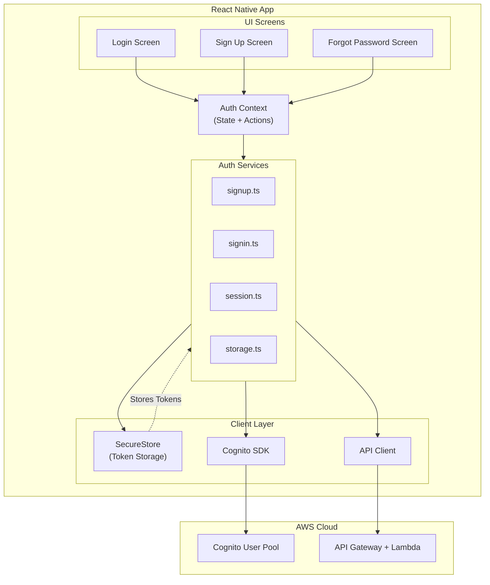

# API Integration

## Overview

This guide covers how to integrate your React Native (Expo) application with AWS backend services using Cognito for authentication and API Gateway for HTTP APIs. The implementation uses Bearer Token authentication with custom in-app UI (no browser redirects).

## Documentation Structure

The API integration documentation is split into three focused documents:

### 1. [Authentication with Cognito](./authentication.md)

Learn how to implement user authentication using AWS Cognito User Pool with the raw SDK (no Amplify).

**Topics covered:**

- Sign up and email verification
- Sign in with username/password
- MFA (Multi-Factor Authentication) support
- Session management and token refresh
- Secure token storage with SecureStore
- Password reset flows
- Auth Context integration

**When to read:** Start here if you're implementing user authentication or want to understand how the authentication system works.

### 2. [API Client Architecture](./api-client.md)

Build a type-safe API client that handles Bearer Token authentication, errors, retries, and caching.

**Topics covered:**

- API Client structure with TypeScript
- Bearer Token authentication with API Gateway
- Request/Response type definitions
- Error handling and user-friendly messages
- Retry logic with exponential backoff
- Response caching strategies
- Best practices for API integration

**When to read:** Read this after understanding authentication, or if you need to make authenticated API calls to your backend.

### 3. [Integration and Complete Examples](./integration-examples.md)

See complete, working examples of authentication screens, protected routes, and data management flows.

**Topics covered:**

- Auth Context Provider implementation
- Data Context with API integration
- Protected route components
- Complete Login, Sign Up, and Forgot Password screens
- Data list screen with pull-to-refresh
- Environment configuration
- Flow diagrams (authentication and API calls)
- Comprehensive best practices

**When to read:** Read this for complete working examples you can copy and adapt for your application.

## Quick Start

If you're just getting started, follow this order:

1. **Set up Authentication** - Read [Authentication](./authentication.md)
   - Install dependencies
   - Configure Cognito User Pool
   - Implement auth services (signup, signin, session, storage)
   - Create Auth Context

2. **Build API Client** - Read [API Client](./api-client.md)
   - Create API client with Bearer Token support
   - Define request/response types
   - Add error handling and retry logic
   - Optionally add caching

3. **Integrate and Test** - Read [Integration Examples](./integration-examples.md)
   - Create Auth Provider component
   - Build login and signup screens
   - Add protected routes
   - Create data contexts that use the API client
   - Test the complete flow

## Key Concepts

### Bearer Token Authentication

This implementation uses **Bearer Token authentication**, where the Cognito ID token is sent directly to API Gateway in the Authorization header. This is simpler than IAM Signature v4 and recommended for most mobile applications.

**Benefits:**

- ✅ Simple - No additional AWS services required
- ✅ Fast - Direct token validation by API Gateway
- ✅ Secure - Tokens are short-lived and cryptographically signed
- ✅ Scalable - API Gateway handles validation automatically

### Custom In-App UI

Unlike approaches that use Cognito Hosted UI or social login redirects, this implementation keeps users in your app at all times using custom React Native screens.

**Benefits:**

- ✅ Users never leave your app
- ✅ Complete control over UI/UX
- ✅ Consistent with your app's design
- ✅ Better user experience

### Type-Safe API Integration

The API client is fully typed with TypeScript, providing compile-time safety and excellent IDE support.

**Benefits:**

- ✅ Catch errors at compile time
- ✅ Better IDE autocomplete
- ✅ Self-documenting code
- ✅ Easier refactoring

## Architecture Overview



## File Structure

```text
app/
├── services/
│   └── auth/
│       ├── signup.ts       # Sign up & verification
│       ├── signin.ts       # Sign in & MFA
│       ├── session.ts      # Session management
│       ├── storage.ts      # Secure token storage
│       └── password.ts     # Password management
├── utils/
│   └── api/
│       ├── ApiClient.ts    # HTTP client with auth
│       ├── ApiError.ts     # Error class
│       ├── DataApi.ts      # Type-safe API methods
│       ├── errorHandling.ts# Error utilities
│       ├── retry.ts        # Retry logic
│       └── cache.ts        # Response caching
├── config/
│   └── cognito.ts          # Cognito User Pool config
├── contexts/
│   ├── AuthContext/
│   │   ├── context.ts      # React context
│   │   ├── state.ts        # State interface
│   │   ├── actions.ts      # Action functions
│   │   └── Provider.tsx    # Context provider
│   └── DataContext/
│       ├── context.ts
│       ├── state.ts
│       ├── actions.ts
│       └── Provider.tsx
├── components/
│   └── ProtectedRoute.tsx  # Route protection
└── types/
    └── api.ts              # API request/response types
```

## Required Dependencies

```bash
# Authentication
npm install amazon-cognito-identity-js expo-secure-store

# API Client (if you want optional IAM signing)
npm install @aws-sdk/signature-v4 @aws-crypto/sha256-js @aws-sdk/protocol-http

# Type safety
npm install --save-dev @types/react @types/react-native
```

## Environment Variables

```env
EXPO_PUBLIC_AWS_REGION=us-east-1
EXPO_PUBLIC_USER_POOL_ID=us-east-1_xxxxxxxxx
EXPO_PUBLIC_USER_POOL_CLIENT_ID=xxxxxxxxxxxxxxxxxxxxxxxxxx
EXPO_PUBLIC_API_URL=https://xxxxxxxxxx.execute-api.us-east-1.amazonaws.com/prod
```

## Common Use Cases

### I need to add login to my app

→ Start with [Authentication](./authentication.md) - Implement sign in, sign up, and password reset flows.

### I need to call my backend API

→ Read [API Client](./api-client.md) - Build a client that handles authentication and errors.

### I want complete working examples

→ Check [Integration Examples](./integration-examples.md) - Copy and adapt production-ready code.

### I need to protect routes from unauthenticated users

→ See Protected Routes in [Integration Examples](./integration-examples.md#protected-route-pattern).

### I want to add MFA support

→ Read Sign In Flow in [Authentication](./authentication.md#sign-in-flow) - Includes MFA handling.

### I need to refresh expired tokens

→ See Session Management in [Authentication](./authentication.md#session-management).

### I want to handle API errors properly

→ Read Error Handling in [API Client](./api-client.md#error-handling).

### I need to cache API responses

→ See Caching Strategies in [API Client](./api-client.md#caching-strategies).

## Related Documentation

- [Context Pattern](./context-pattern.md) - Learn about React Context for state management
- [Navigation Pattern](./navigation-pattern.md) - Understand navigation and routing
- [Types and Configuration](./types-and-configuration.md) - TypeScript patterns
- [Testing Strategy](./testing/) - Test your authentication and API integration
