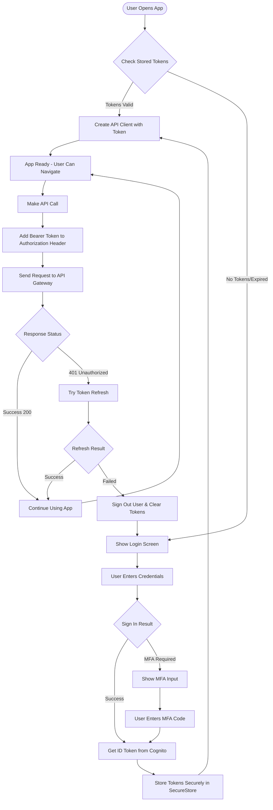
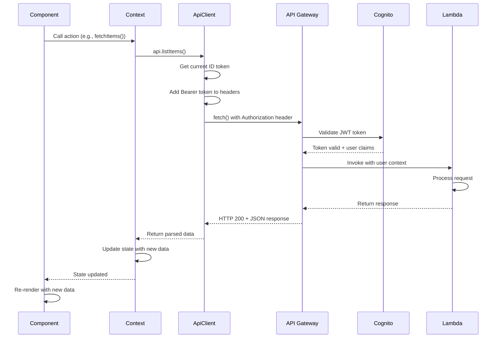

# Integration and Complete Examples

## Overview

This document provides complete, working examples of integrating authentication and API clients with React contexts, implementing protected routes, and building full-featured screens for your React Native (Expo) application.

## Table of Contents

- [Context Integration](#context-integration)
- [Complete Screen Examples](#complete-screen-examples)
- [Environment Configuration](#environment-configuration)
- [Best Practices](#best-practices)
- [Flow Diagrams](#flow-diagrams)

## Context Integration

### Auth Context Provider

Complete implementation of the Auth Context Provider that manages authentication state and restores sessions on app startup.

```typescript
// contexts/AuthContext/Provider.tsx
import React, { useState, useEffect, useMemo } from 'react';
import { AuthContext } from './context';
import { AuthState, initialAuthState } from './state';
import { createAuthActions } from './actions';
import { getCurrentSession } from '@/services/auth/session';
import { getStoredTokens, getStoredUserInfo } from '@/services/auth/storage';

export function AuthProvider({ children }: { children: React.ReactNode }) {
  const [state, setState] = useState<AuthState>(initialAuthState);

  // Create actions with current state
  const actions = useMemo(
    () => createAuthActions(state, setState),
    [state]
  );

  // Restore session on mount
  useEffect(() => {
    const restoreSession = async () => {
      try {
        // Try to get stored tokens
        const tokens = await getStoredTokens();
        const userInfo = await getStoredUserInfo();

        if (!tokens || !userInfo) {
          setState({ ...initialAuthState, isLoading: false });
          return;
        }

        // Verify session is still valid
        const session = await getCurrentSession();

        setState({
          ...state,
          isAuthenticated: true,
          isLoading: false,
          user: userInfo,
          tokens: {
            accessToken: session.accessToken,
            idToken: session.idToken,
            refreshToken: session.refreshToken,
          },
        });
      } catch (error) {
        // Session restoration failed
        setState({ ...initialAuthState, isLoading: false });
      }
    };

    restoreSession();
  }, []);

  return (
    <AuthContext.Provider value={{ state, actions }}>
      {children}
    </AuthContext.Provider>
  );
}
```

### Data Context with API Integration

Complete implementation showing how to create an API client that automatically handles token injection and refresh.

```typescript
// contexts/DataContext/Provider.tsx
import React, { useState, useMemo, useCallback } from 'react';
import { DataApi } from '@/utils/api/DataApi';
import { ApiClient } from '@/utils/api/ApiClient';
import { useAuthContext } from '@/contexts/AuthContext';
import { getCurrentSession } from '@/services/auth/session';
import { DataState } from './state';
import { DataContext } from './context';
import { getErrorMessage, shouldLogout } from '@/utils/api/errorHandling';
import { CreateDataRequest } from '@/types/api';

export function DataProvider({ children }: { children: React.ReactNode }) {
  const { state: authState, actions: authActions } = useAuthContext();
  const [state, setState] = useState<DataState>({
    loading: false,
    items: [],
    error: null,
  });

  // Create API client that uses ID token
  const api = useMemo(() => {
    if (!authState.isAuthenticated || !authState.tokens) {
      return null;
    }

    const client = new ApiClient(
      {
        baseUrl: process.env.EXPO_PUBLIC_API_URL!,
      },
      // Pass function to get current ID token
      async () => {
        if (!authState.tokens) {
          throw new Error('No tokens available');
        }

        // Optionally refresh if expired
        try {
          const session = await getCurrentSession();
          return session.idToken;
        } catch (error) {
          // Session expired, refresh it
          await authActions.refreshSession();
          
          // After refresh, state will update and new tokens will be available
          if (!authState.tokens) {
            throw new Error('Failed to refresh session');
          }
          
          return authState.tokens.idToken;
        }
      }
    );

    return new DataApi(client);
  }, [authState.isAuthenticated, authState.tokens, authActions]);

  const fetchItems = useCallback(async () => {
    if (!api) {
      setState(prev => ({ ...prev, error: 'Not authenticated' }));
      return;
    }

    setState(prev => ({ ...prev, loading: true, error: null }));

    try {
      const response = await api.listItems();
      setState({
        loading: false,
        items: response.items,
        error: null,
      });
    } catch (error) {
      // Check if we should sign out
      if (shouldLogout(error)) {
        await authActions.signOut();
        return;
      }

      setState({
        loading: false,
        items: [],
        error: getErrorMessage(error),
      });
    }
  }, [api, authActions]);

  const createItem = useCallback(async (data: CreateDataRequest) => {
    if (!api) {
      throw new Error('Not authenticated');
    }

    setState(prev => ({ ...prev, loading: true, error: null }));

    try {
      const newItem = await api.createItem(data);
      setState(prev => ({
        loading: false,
        items: [...prev.items, newItem],
        error: null,
      }));
      return newItem;
    } catch (error) {
      if (shouldLogout(error)) {
        await authActions.signOut();
        throw error;
      }

      setState(prev => ({
        ...prev,
        loading: false,
        error: getErrorMessage(error),
      }));
      throw error;
    }
  }, [api, authActions]);

  // ... other actions (updateItem, deleteItem, etc.)

  const contextValue = useMemo(
    () => ({
      state,
      actions: {
        fetchItems,
        createItem,
        // ... other actions
      },
    }),
    [state, fetchItems, createItem]
  );

  return (
    <DataContext.Provider value={contextValue}>
      {children}
    </DataContext.Provider>
  );
}
```

### Protected Route Pattern

Component that protects routes from unauthenticated access and handles loading states.

```typescript
// components/ProtectedRoute.tsx
import { useAuthContext } from '@/contexts/AuthContext';
import { Redirect } from 'expo-router';
import { View, ActivityIndicator } from 'react-native';

export function ProtectedRoute({ children }: { children: React.ReactNode }) {
  const { state } = useAuthContext();

  if (state.isLoading) {
    return (
      <View style={{ flex: 1, justifyContent: 'center', alignItems: 'center' }}>
        <ActivityIndicator size="large" />
      </View>
    );
  }

  if (!state.isAuthenticated) {
    return <Redirect href="/login" />;
  }

  return <>{children}</>;
}
```

### Using in Screens

Simple example of a protected screen that fetches data:

```typescript
// app/(tabs)/data.tsx
import React, { useEffect } from 'react';
import { View, Text, ActivityIndicator } from 'react-native';
import { useDataContext } from '@/contexts/DataContext';
import { ProtectedRoute } from '@/components/ProtectedRoute';

export default function DataScreen() {
  const { state, actions } = useDataContext();

  useEffect(() => {
    actions.fetchItems();
  }, []);

  return (
    <ProtectedRoute>
      <View>
        {state.loading && <ActivityIndicator />}
        {state.error && <Text>{state.error}</Text>}
        {state.items.map(item => (
          <Text key={item.id}>{item.title}</Text>
        ))}
      </View>
    </ProtectedRoute>
  );
}
```

## Complete Screen Examples

### Login Screen

Full-featured login screen with MFA support and error handling.

```typescript
// app/login.tsx
import React, { useState, useEffect } from 'react';
import { View, TextInput, Button, Text, ActivityIndicator } from 'react-native';
import { useAuthContext } from '@/contexts/AuthContext';
import { router } from 'expo-router';

export default function LoginScreen() {
  const { state, actions } = useAuthContext();
  const [username, setUsername] = useState('');
  const [password, setPassword] = useState('');
  const [mfaCode, setMfaCode] = useState('');

  const handleSignIn = async () => {
    try {
      await actions.signIn(username, password);
      
      // If no MFA required, redirect to home
      if (!state.pendingMFA) {
        router.replace('/(tabs)');
      }
    } catch (error) {
      // Error is already in state.error
      console.error('Sign in failed:', error);
    }
  };

  const handleMFASubmit = async () => {
    try {
      await actions.confirmMFA(mfaCode);
      router.replace('/(tabs)');
    } catch (error) {
      console.error('MFA verification failed:', error);
    }
  };

  // Redirect if already authenticated
  useEffect(() => {
    if (state.isAuthenticated) {
      router.replace('/(tabs)');
    }
  }, [state.isAuthenticated]);

  if (state.isLoading) {
    return (
      <View style={{ flex: 1, justifyContent: 'center', alignItems: 'center' }}>
        <ActivityIndicator size="large" />
      </View>
    );
  }

  // Show MFA screen
  if (state.pendingMFA) {
    return (
      <View style={{ padding: 20 }}>
        <Text>Enter verification code</Text>
        <TextInput
          placeholder="MFA Code"
          value={mfaCode}
          onChangeText={setMfaCode}
          keyboardType="number-pad"
        />
        <Button title="Verify" onPress={handleMFASubmit} />
        {state.error && <Text style={{ color: 'red' }}>{state.error}</Text>}
      </View>
    );
  }

  return (
    <View style={{ padding: 20 }}>
      <Text>Sign In</Text>
      <TextInput
        placeholder="Username or Email"
        value={username}
        onChangeText={setUsername}
        autoCapitalize="none"
        autoCorrect={false}
      />
      <TextInput
        placeholder="Password"
        value={password}
        onChangeText={setPassword}
        secureTextEntry
      />
      <Button title="Sign In" onPress={handleSignIn} />
      <Button
        title="Create Account"
        onPress={() => router.push('/signup')}
      />
      <Button
        title="Forgot Password?"
        onPress={() => router.push('/forgot-password')}
      />
      {state.error && <Text style={{ color: 'red' }}>{state.error}</Text>}
    </View>
  );
}
```

### Sign Up Screen

Complete sign up flow with email verification.

```typescript
// app/signup.tsx
import React, { useState } from 'react';
import { View, TextInput, Button, Text } from 'react-native';
import { useAuthContext } from '@/contexts/AuthContext';
import { router } from 'expo-router';

export default function SignUpScreen() {
  const { state, actions } = useAuthContext();
  const [username, setUsername] = useState('');
  const [email, setEmail] = useState('');
  const [password, setPassword] = useState('');
  const [confirmPassword, setConfirmPassword] = useState('');
  const [verificationCode, setVerificationCode] = useState('');
  const [needsVerification, setNeedsVerification] = useState(false);

  const handleSignUp = async () => {
    if (password !== confirmPassword) {
      alert('Passwords do not match');
      return;
    }

    try {
      await actions.signUp({ username, email, password });
      setNeedsVerification(true);
    } catch (error) {
      console.error('Sign up failed:', error);
    }
  };

  const handleVerify = async () => {
    try {
      await actions.confirmSignUp(username, verificationCode);
      alert('Account verified! Please sign in.');
      router.replace('/login');
    } catch (error) {
      console.error('Verification failed:', error);
    }
  };

  if (needsVerification) {
    return (
      <View style={{ padding: 20 }}>
        <Text>Check your email for verification code</Text>
        <TextInput
          placeholder="Verification Code"
          value={verificationCode}
          onChangeText={setVerificationCode}
          keyboardType="number-pad"
        />
        <Button title="Verify" onPress={handleVerify} />
        <Button
          title="Resend Code"
          onPress={() => actions.signUp({ username, email, password })}
        />
        {state.error && <Text style={{ color: 'red' }}>{state.error}</Text>}
      </View>
    );
  }

  return (
    <View style={{ padding: 20 }}>
      <Text>Create Account</Text>
      <TextInput
        placeholder="Username"
        value={username}
        onChangeText={setUsername}
        autoCapitalize="none"
        autoCorrect={false}
      />
      <TextInput
        placeholder="Email"
        value={email}
        onChangeText={setEmail}
        keyboardType="email-address"
        autoCapitalize="none"
        autoCorrect={false}
      />
      <TextInput
        placeholder="Password"
        value={password}
        onChangeText={setPassword}
        secureTextEntry
      />
      <TextInput
        placeholder="Confirm Password"
        value={confirmPassword}
        onChangeText={setConfirmPassword}
        secureTextEntry
      />
      <Button title="Sign Up" onPress={handleSignUp} />
      <Button
        title="Back to Sign In"
        onPress={() => router.back()}
      />
      {state.error && <Text style={{ color: 'red' }}>{state.error}</Text>}
    </View>
  );
}
```

### Forgot Password Screen

Password reset flow with verification code.

```typescript
// app/forgot-password.tsx
import React, { useState } from 'react';
import { View, TextInput, Button, Text } from 'react-native';
import { useAuthContext } from '@/contexts/AuthContext';
import { router } from 'expo-router';

export default function ForgotPasswordScreen() {
  const { state, actions } = useAuthContext();
  const [username, setUsername] = useState('');
  const [code, setCode] = useState('');
  const [newPassword, setNewPassword] = useState('');
  const [confirmPassword, setConfirmPassword] = useState('');
  const [codeSent, setCodeSent] = useState(false);

  const handleSendCode = async () => {
    try {
      await actions.forgotPassword(username);
      setCodeSent(true);
    } catch (error) {
      console.error('Failed to send code:', error);
    }
  };

  const handleResetPassword = async () => {
    if (newPassword !== confirmPassword) {
      alert('Passwords do not match');
      return;
    }

    try {
      await actions.confirmPassword(username, code, newPassword);
      alert('Password reset successful! Please sign in.');
      router.replace('/login');
    } catch (error) {
      console.error('Password reset failed:', error);
    }
  };

  if (codeSent) {
    return (
      <View style={{ padding: 20 }}>
        <Text>Check your email for reset code</Text>
        <TextInput
          placeholder="Reset Code"
          value={code}
          onChangeText={setCode}
          keyboardType="number-pad"
        />
        <TextInput
          placeholder="New Password"
          value={newPassword}
          onChangeText={setNewPassword}
          secureTextEntry
        />
        <TextInput
          placeholder="Confirm New Password"
          value={confirmPassword}
          onChangeText={setConfirmPassword}
          secureTextEntry
        />
        <Button title="Reset Password" onPress={handleResetPassword} />
        <Button title="Resend Code" onPress={handleSendCode} />
        {state.error && <Text style={{ color: 'red' }}>{state.error}</Text>}
      </View>
    );
  }

  return (
    <View style={{ padding: 20 }}>
      <Text>Reset Password</Text>
      <TextInput
        placeholder="Username or Email"
        value={username}
        onChangeText={setUsername}
        autoCapitalize="none"
        autoCorrect={false}
      />
      <Button title="Send Reset Code" onPress={handleSendCode} />
      <Button title="Back to Sign In" onPress={() => router.back()} />
      {state.error && <Text style={{ color: 'red' }}>{state.error}</Text>}
    </View>
  );
}
```

### Data List Screen

Full-featured data management screen with pull-to-refresh and error handling.

```typescript
// screens/DataListScreen.tsx
import React, { useEffect } from 'react';
import { View, FlatList, Button, ActivityIndicator, Text } from 'react-native';
import { useDataContext } from '@/contexts/DataContext';
import { useAuthContext } from '@/contexts/AuthContext';
import { ProtectedRoute } from '@/components/ProtectedRoute';

export default function DataListScreen() {
  const { state, actions } = useDataContext();
  const { actions: authActions } = useAuthContext();

  useEffect(() => {
    actions.fetchItems();
  }, []);

  const handleRefresh = () => {
    actions.fetchItems();
  };

  const handleSignOut = async () => {
    await authActions.signOut();
  };

  return (
    <ProtectedRoute>
      <View style={{ flex: 1 }}>
        <Button title="Sign Out" onPress={handleSignOut} />
        
        {state.loading && <ActivityIndicator size="large" />}
        
        {state.error && (
          <View>
            <Text style={{ color: 'red' }}>{state.error}</Text>
            <Button title="Retry" onPress={handleRefresh} />
          </View>
        )}

        <FlatList
          data={state.items}
          keyExtractor={(item) => item.id}
          renderItem={({ item }) => (
            <View style={{ padding: 16, borderBottomWidth: 1 }}>
              <Text style={{ fontSize: 18, fontWeight: 'bold' }}>
                {item.title}
              </Text>
              <Text>{item.description}</Text>
            </View>
          )}
          refreshing={state.loading}
          onRefresh={handleRefresh}
        />
      </View>
    </ProtectedRoute>
  );
}
```

## Environment Configuration

### Environment Variables

```env
# .env or app.json extra config
EXPO_PUBLIC_AWS_REGION=us-east-1
EXPO_PUBLIC_USER_POOL_ID=us-east-1_xxxxxxxxx
EXPO_PUBLIC_USER_POOL_CLIENT_ID=xxxxxxxxxxxxxxxxxxxxxxxxxx
EXPO_PUBLIC_API_URL=https://xxxxxxxxxx.execute-api.us-east-1.amazonaws.com/prod
```

### App Configuration

```json
// app.json
{
  "expo": {
    "name": "Your App Name",
    "slug": "your-app-slug",
    "extra": {
      "awsRegion": "us-east-1",
      "userPoolId": "us-east-1_xxxxxxxxx",
      "userPoolClientId": "xxxxxxxxxxxxxxxxxxxxxxxxxx",
      "apiUrl": "https://xxxxxxxxxx.execute-api.us-east-1.amazonaws.com/prod"
    }
  }
}
```

## Best Practices

### Authentication

**Do's:**

- ✅ **Store tokens securely** using `expo-secure-store`
- ✅ **Auto-refresh sessions** before they expire
- ✅ **Clear tokens on sign out** completely
- ✅ **Handle MFA flows** gracefully
- ✅ **Restore sessions** on app restart
- ✅ **Validate inputs** before sending to Cognito
- ✅ **Handle all error cases** (wrong password, user not found, etc.)

**Don'ts:**

- ❌ **Don't store tokens in AsyncStorage** (use SecureStore)
- ❌ **Don't hardcode credentials** or tokens
- ❌ **Don't skip token refresh** logic
- ❌ **Don't ignore session expiration**
- ❌ **Don't expose sensitive user data** in logs or errors

### API Integration

**Do's:**

- ✅ **Use TypeScript** for all API types
- ✅ **Implement proper error handling** with user-friendly messages
- ✅ **Use retry logic** for transient failures (5xx, 429)
- ✅ **Cache responses** when appropriate (GET requests)
- ✅ **Handle 401 errors** by signing out user
- ✅ **Create API client factories** that inject auth tokens
- ✅ **Use contexts** to share API clients across components

**Don'ts:**

- ❌ **Don't hardcode API endpoints** (use environment variables)
- ❌ **Don't ignore error responses**
- ❌ **Don't retry non-retryable errors** (4xx except 429)
- ❌ **Don't cache sensitive data** indefinitely
- ❌ **Don't expose credentials** in client code
- ❌ **Don't make API calls** before user is authenticated
- ❌ **Don't forget to handle** token expiration in API calls

### Security

**Do's:**

- ✅ **Always use HTTPS** for API calls
- ✅ **Validate JWT tokens** on the backend
- ✅ **Use short token expiration** times (1 hour recommended)
- ✅ **Implement rate limiting** on sensitive endpoints
- ✅ **Log authentication events** for security monitoring
- ✅ **Use MFA** for sensitive operations
- ✅ **Sanitize user inputs** before displaying

**Don'ts:**

- ❌ **Don't trust client-side validation** alone
- ❌ **Don't log sensitive data** (tokens, passwords, PII)
- ❌ **Don't use weak passwords** (enforce policies in Cognito)
- ❌ **Don't store passwords** locally
- ❌ **Don't share tokens** between users or devices
- ❌ **Don't skip SSL certificate validation**

### Performance

**Do's:**

- ✅ **Cache API responses** with appropriate TTL
- ✅ **Debounce search/filter** requests
- ✅ **Implement pagination** for large lists
- ✅ **Use optimistic updates** for better UX
- ✅ **Prefetch data** when possible
- ✅ **Cancel pending requests** on navigation

**Don'ts:**

- ❌ **Don't make unnecessary API calls**
- ❌ **Don't fetch entire datasets** (use pagination)
- ❌ **Don't block UI** while loading
- ❌ **Don't cache forever** (set reasonable TTLs)
- ❌ **Don't retry indefinitely** (set max attempts)

## Flow Diagrams

### Authentication Flow



### API Call Flow



## Next Steps

- Read [Authentication](./authentication.md) for detailed auth implementation
- Read [API Client](./api-client.md) for API client architecture
- Read [Context Pattern](./context-pattern.md) for state management patterns
- Read [Navigation Pattern](./navigation-pattern.md) for protected routes
- Read [Testing Strategy](./testing/) for testing your implementation
