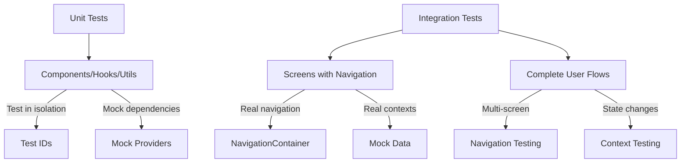

# Testing Strategy Summary

## Overview

This document provides a comprehensive overview of the testing strategy for this React Native Expo application. The testing approach uses Jest and React Native Testing Library to ensure code quality, maintainability, and reliability.

## Table of Contents

- [Testing Approach](#testing-approach)
- [Documentation Navigation](#documentation-navigation)
- [Testing Layers](#testing-layers)
- [Quick Reference](#quick-reference)
- [When to Use Each Testing Approach](#when-to-use-each-testing-approach)

## Testing Approach

Our testing strategy follows these core principles:

1. **Test behavior, not implementation**: Focus on what users see and interact with
2. **Isolation**: Each test should be independent and not affect others
3. **Comprehensive coverage**: Test happy paths, error cases, and edge cases
4. **Realistic testing**: Use real navigation and contexts with mock data
5. **Maintainability**: Keep tests readable, organized, and easy to update

## Quick Decision Guide

**What are you testing?**

```plaintext
Component → What dependencies does it have?
│
├─ Uses React Context (auth, theme, data)
│  └─ Use: Mock Provider Pattern
│     See: Unit Testing - Mock Provider Pattern
│
├─ Makes API calls or uses storage
│  └─ Use: Mock Factory Pattern
│     See: Factory Pattern & Decision Guide
│
├─ Has simple callbacks (onPress, onChange)
│  └─ Use: jest.fn() directly
│     See: Unit Testing - Component Testing
│
└─ Pure utility or business logic
   └─ Use: Real implementation, no mocking
      See: Unit Testing - Utility Testing
```

**For detailed decision trees and tables, see [Decision Guide](./decision-guide.md).**

## Documentation Navigation

### Quick Start

**New to testing?** Start here:

1. [Setup](./setup.md) - Configure Jest and React Native Testing Library
2. [Unit Testing](./unit-testing.md) - Learn to test components and hooks
3. [Best Practices](./best-practices.md) - Follow testing conventions

**Setting up tests for a component?** Read:

1. [Decision Guide](./decision-guide.md) - Choose the right mocking approach
2. [Mocking Strategy](./mocking-strategy.md) - Understand what and how to mock
3. [Unit Testing](./unit-testing.md) - Test individual components
4. [Best Practices](./best-practices.md) - Follow coding standards

**Testing components with API calls or storage?** Read:

1. [Decision Guide](./decision-guide.md) - Confirm factory pattern is appropriate
2. [Factory Pattern](./factory-pattern.md) - Learn how to create mock factories
3. [Unit Testing](./unit-testing.md#testing-components-with-service-dependencies) - See dependency injection examples
4. [Best Practices](./best-practices.md#test-isolation-with-factories) - Ensure proper test isolation

**Testing components with React Context?** Read:

1. [Decision Guide](./decision-guide.md) - Understand provider vs factory
2. [Unit Testing](./unit-testing.md#mock-provider-pattern) - Create mock providers
3. [Mocking Strategy](./mocking-strategy.md#mocking-contexts) - Context mocking patterns

**Testing complete flows?** Read:

1. [Integration Testing](./integration-testing.md) - Test screens with navigation
2. [Mocking Strategy](./mocking-strategy.md) - Mock contexts and APIs
3. [Best Practices](./best-practices.md) - Maintain test quality

### Detailed Documentation

#### [Setup](./setup.md)

Complete Jest and React Native Testing Library configuration.

**Topics:**

- Jest configuration with jest-expo preset
- Global test setup and mocks
- Test scripts and commands
- Configuration files explained

**Read this if:**

- You're setting up testing for the first time
- You need to add new global mocks
- You're troubleshooting test configuration issues

#### [Unit Testing](./unit-testing.md)

Testing individual components, hooks, and utilities.

**Topics:**

- Component testing patterns
- Testing hooks with React Native Testing Library
- Testing utilities and helper functions
- Mock provider pattern for contexts
- Test ID conventions
- Async testing with waitFor and act

**Read this if:**

- You're testing individual components
- You need to test custom hooks
- You're testing utility functions
- You're working with context-dependent components

#### [Integration Testing](./integration-testing.md)

Testing complete user flows with navigation and multiple contexts.

**Topics:**

- Screen testing with NavigationContainer
- Testing navigation flows
- Multi-context testing
- Testing complete user journeys
- Mock navigation stacks

**Read this if:**

- You're testing screen components
- You need to verify navigation behavior
- You're testing features that span multiple screens
- You're testing complete user workflows

#### [Mocking Strategy](./mocking-strategy.md)

Guidelines for what to mock and how to mock it effectively.

**Topics:**

- When to mock vs. use real implementations
- Choosing the right mocking approach
- Mocking contexts with mock providers
- Mocking API clients with factory pattern
- Mocking navigation
- Mock data factories
- External dependency mocking

**Read this if:**

- You're unsure what to mock in your tests
- You need to create mock providers for contexts
- You're mocking API calls or services
- You're setting up mock data
- You need to choose between factory, provider, or direct mock

#### [Best Practices](./best-practices.md)

Coding standards and conventions for writing quality tests.

**Topics:**

- Test structure and organization
- Naming conventions
- Test isolation patterns
- Factory state clearing
- Descriptive test cases
- Code coverage guidelines
- Common pitfalls and solutions

**Read this if:**

- You want to write maintainable tests
- You're establishing testing standards
- You're reviewing test code
- You need to improve test quality

#### [Factory Pattern](./factory-pattern.md)

Comprehensive guide to using factory pattern for mock objects.

**Topics:**

- When to use factory pattern
- Creating mock factories for I/O services
- Method chaining and configuration
- Interaction capture and verification
- State management in factories
- Test isolation with `.clear()` method

**Read this if:**

- You're mocking API clients or storage services
- You need to capture and verify interactions
- You want reusable mocks across test files
- You're testing services with complex behaviors
- You need to ensure test isolation

#### [Decision Guide](./decision-guide.md)

Quick decision trees and tables for choosing the right testing approach.

**Topics:**

- Decision trees for mocking approaches
- Factory vs Provider vs Direct Mock comparison
- Common testing scenarios and solutions
- When to use each pattern
- Step-by-step decision process

**Read this if:**

- You're unsure which mocking approach to use
- You need quick guidance on testing patterns
- You're choosing between factory and provider
- You want to understand when to use jest.fn() vs factory
- You're looking for testing pattern examples

## Testing Layers



### Unit Tests

**What:** Test individual components, hooks, and utilities in isolation

**How:**

- Render components with mock providers
- Test component props and state
- Verify UI rendering and interactions
- Test custom hooks with renderHook
- Test utilities with pure function testing

**Example:**

```typescript
describe('MyComponent', () => {
  it('Should render data correctly', () => {
    const mockContext = createMockContextValue();
    const { getByTestId } = render(
      <MockProvider value={mockContext}>
        <MyComponent />
      </MockProvider>
    );
    expect(getByTestId('data-display')).toBeTruthy();
  });
});
```

### Integration Tests

**What:** Test complete features with navigation and state management

**How:**

- Use real NavigationContainer
- Use real context providers with mock data
- Test navigation between screens
- Verify state changes across components
- Test complete user workflows

**Example:**

```typescript
describe('MyScreen', () => {
  it('Should navigate to detail screen on item press', async () => {
    const { getByTestId } = render(
      <NavigationContainer>
        <MockContextProvider value={mockData}>
          <Stack.Navigator>
            <Stack.Screen name="List" component={ListScreen} />
            <Stack.Screen name="Detail" component={DetailScreen} />
          </Stack.Navigator>
        </MockContextProvider>
      </NavigationContainer>
    );
    
    fireEvent.press(getByTestId('item-1'));
    
    await waitFor(() => {
      expect(getByTestId('detail-screen')).toBeTruthy();
    });
  });
});
```

## Quick Reference

### Common Testing Patterns

| Pattern | Use Case | Documentation |
|---------|----------|---------------|
| Mock Provider | Testing context-dependent components | [Unit Testing](./unit-testing.md#mock-provider-pattern) |
| Mock Factory | Testing I/O services (API, storage) | [Factory Pattern](./factory-pattern.md) |
| Decision Guide | Choosing mocking approach | [Decision Guide](./decision-guide.md) |
| Test IDs | Selecting elements in tests | [Unit Testing](./unit-testing.md#test-id-pattern) |
| Navigation Testing | Testing screen navigation | [Integration Testing](./integration-testing.md#navigation-testing) |
| Async Testing | Testing async operations | [Unit Testing](./unit-testing.md#async-testing) |
| Mock Data Factories | Creating reusable test data | [Mocking Strategy](./mocking-strategy.md#mock-data-factories) |

### Test File Organization

```plaintext
src/
├── components/
│   ├── MyComponent.tsx
│   ├── components.ids.ts
│   └── __tests__/
│       ├── MyComponent.test.tsx
│       └── MyComponent.mock.tsx
├── contexts/
│   ├── MyContext/
│   │   ├── Context.tsx
│   │   ├── Provider.tsx
│   │   └── __tests__/
│   │       ├── Context.test.tsx
│   │       └── Context.mock.tsx
└── screens/
    ├── MyScreen.tsx
    ├── screens.ids.ts
    └── __tests__/
        ├── MyScreen.test.tsx
        └── MyScreen.mock.tsx
```

## When to Use Each Testing Approach

### Use Unit Tests When

- Testing a single component in isolation
- Testing custom hooks
- Testing utility functions
- Testing data transformations
- You need fast feedback during development
- Testing component logic without navigation

### Use Integration Tests When

- Testing screen components
- Testing navigation flows
- Testing features that span multiple components
- Testing state management across contexts
- Verifying complete user workflows
- Testing interactions between components

### Use Factory Pattern When

- Testing services that perform I/O operations
- Need to capture and verify interactions
- Multiple test scenarios require different behaviors
- Same mock needed across multiple test files
- Testing API clients, storage services, or native modules
- Need to ensure test isolation with state clearing

**For detailed guidance, see [Factory Pattern](./factory-pattern.md) and [Decision Guide](./decision-guide.md).**

### Don't Test

- Third-party library internals
- React Native core components
- Implementation details
- Styles (unless functionality depends on them)

## Running Tests

### Run All Tests

```bash
npm test
```

### Watch Mode

```bash
npm run test:watch
```

### Coverage Report

```bash
npm run test:coverage
```

### Run Specific Test File

```bash
npm test -- MyComponent.test.tsx
```

### Run Tests Matching Pattern

```bash
npm test -- --testNamePattern="Should render"
```

## Next Steps

1. **New to testing?** Start with [Setup](./setup.md)
2. **Ready to write tests?** Go to [Unit Testing](./unit-testing.md)
3. **Need to test navigation?** See [Integration Testing](./integration-testing.md)
4. **Want best practices?** Read [Best Practices](./best-practices.md)
5. **Unsure what to mock?** Check [Mocking Strategy](./mocking-strategy.md)
6. **Mocking services?** See [Factory Pattern](./factory-pattern.md)
7. **Need quick guidance?** Use [Decision Guide](./decision-guide.md)

## Additional Resources

- [React Native Testing Library Documentation](https://callstack.github.io/react-native-testing-library/)
- [Jest Documentation](https://jestjs.io/docs/getting-started)
- [Expo Testing Guide](https://docs.expo.dev/develop/unit-testing/)
- [React Navigation Testing](https://reactnavigation.org/docs/testing/)
